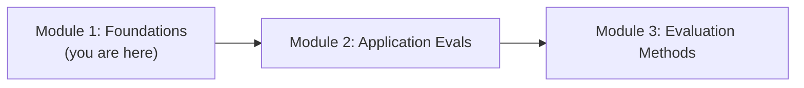
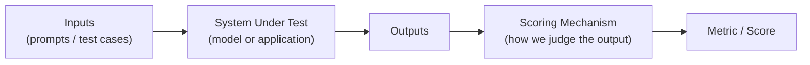
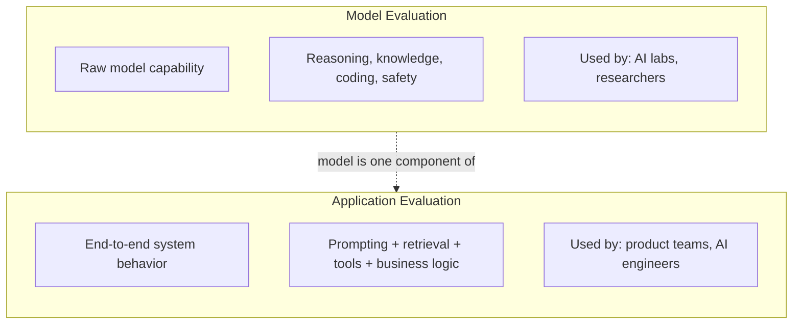
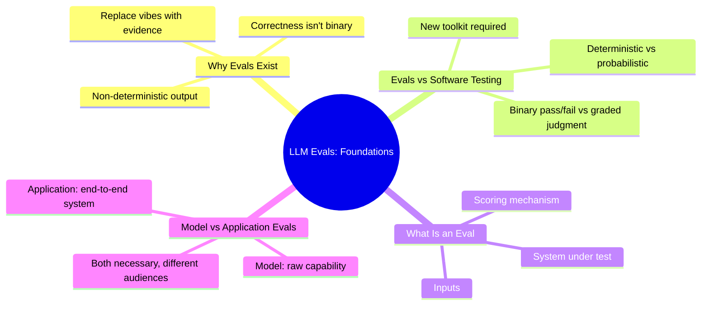

# Module 1 — Foundations

> **Module Goal:** Build the conceptual bedrock for everything that follows. By the end of this module, you should understand *why* LLM evaluation exists as its own discipline, how it differs fundamentally from traditional software testing, and the core distinction between evaluating a model and evaluating an application built on top of one.

---

## 📍 Where This Fits

This is the first module in the repository. Nothing here assumes prior knowledge of evals, benchmarks, or LLM internals. If you're comfortable with how a language model generates text at a high level, you have everything you need.



---

## 1. Why Do We Need LLM Evals?

### Intuition

Imagine you hire someone for a job based purely on a great interview. They said the right things, sounded confident, and seemed sharp. Three months later, you discover they consistently miss deadlines, give wrong answers to customers, and can't be trusted with sensitive decisions.

The interview told you they *could* sound competent. It told you almost nothing about whether they'd *actually perform well* on the job, day after day, across the specific tasks your business needs done.

This is exactly the situation with large language models. A model can write a beautiful paragraph, solve a clever riddle, or produce an impressively fluent answer in a demo — and still fail badly when deployed into a real product, at scale, across thousands of unpredictable user inputs.

**LLM Evals exist to answer one question, rigorously and repeatedly: does this model or system actually do what we need it to do — reliably, safely, and correctly?**

### Definition

**LLM Evaluation** is the systematic process of measuring the performance, reliability, safety, and quality of a large language model or an LLM-powered application, using structured methods rather than informal impressions.

### Why It Exists

Language models are fundamentally different from traditional software in one critical way: **their output is not deterministic, and correctness is often not binary.**

A calculator either returns `4` for `2+2`, or it has a bug. But if you ask an LLM to "summarize this article," there isn't one single correct summary. There's a *space* of acceptable summaries, and an even larger space of subtly wrong, misleading, or unsafe ones. Without evals, teams are left guessing — shipping based on a handful of manually inspected examples, or worse, based on how impressive the model *feels* in casual testing.

Evals exist to replace that guesswork with evidence.

### Real-World Analogy

Think of LLM evals like **clinical trials for a new drug**.

A drug might work wonderfully for the handful of patients a researcher personally observes. But before it can be trusted at scale, it has to go through structured trials — controlled, repeatable, measured against clear endpoints, and tested across diverse populations. Only then do you know whether it actually works, for whom, and under what conditions.

LLM evals play the same role for models and AI applications: structured, repeatable measurement that stands in for "trust me, it works."

### Practical Example

Suppose you're building a customer support chatbot. In casual testing, you ask it five questions and it answers all five well. You ship it.

A week later, you discover it:
- Gives outdated refund policy information (a **factuality failure**)
- Occasionally agrees to promises the company can't keep (a **safety/business-risk failure**)
- Handles simple questions perfectly but falls apart on multi-step billing disputes (a **capability gap**)

An eval suite — built *before* shipping — would have surfaced all three issues using a structured set of test cases, not luck.

### Industry Use Case

Every major AI lab (OpenAI, Anthropic, Google DeepMind) runs extensive evaluation suites before releasing a new model, covering everything from factual accuracy to safety refusals to coding ability. Production companies building on top of these models run their *own* application-level evals, because a model that scores well on general benchmarks can still fail badly on a company's specific use case.

> **Note:** This is a preview of a distinction we'll cover in depth later in this module — *model* evals versus *application* evals are not the same thing, and both are necessary.

### Common Mistakes

- **Relying on vibes.** Testing a handful of prompts manually and concluding "it works" is not evaluation — it's anecdote.
- **Assuming a good public benchmark score means it'll work for your use case.** General capability doesn't guarantee task-specific reliability.
- **Treating evaluation as a one-time gate before launch.** Models and usage patterns drift; evaluation needs to be continuous (more on this in Module 4).

### Interview Questions

- Why can't we evaluate LLMs the same way we evaluate traditional software?
- What risks does a company take on by skipping structured evaluation before deployment?
- Give an example of a failure mode that manual "vibe checking" would miss but a structured eval would catch.

### Key Takeaways

- LLMs produce non-deterministic, often non-binary outputs, which makes informal testing unreliable.
- Evals replace subjective impressions with structured, repeatable measurement.
- Skipping evals doesn't eliminate risk — it just defers discovery of that risk to production, where it's more expensive.

---

## 2. LLM Evaluation vs. Software Testing

### Intuition

Traditional software testing is built on a simple premise: for a given input, there is a known, correct output, and you write a test that checks for it.

```python
assert add(2, 2) == 4
```

This works because software is deterministic and specified. LLMs break both of those assumptions. Ask a model the same question twice, and you might get two differently worded (but both valid) answers. Ask it a subjective question — "write a persuasive email" — and there's no single correct string to assert against.

This doesn't mean testing principles don't apply to LLMs. It means they have to be adapted for a world where "correct" is often a *range*, a *quality judgment*, or a *probabilistic* property rather than an exact match.

### Definition

**Software testing** verifies that code behaves according to a fixed specification, typically through deterministic pass/fail assertions.

**LLM evaluation** measures the quality, correctness, safety, and reliability of probabilistic, often open-ended outputs — frequently requiring graded, statistical, or judgment-based measures rather than simple pass/fail assertions.

### Why It Exists (The Core Contrast)

| Dimension | Traditional Software Testing | LLM Evaluation |
|---|---|---|
| **Output nature** | Deterministic — same input, same output | Often non-deterministic — same input, varying output |
| **Correctness** | Usually binary (pass/fail) | Often graded, subjective, or probabilistic |
| **Specification** | Precise, written spec | Frequently no single "correct" answer exists |
| **Test method** | Unit tests, integration tests, assertions | Programmatic checks, human judgment, model-based judgment, statistical analysis |
| **Failure surface** | Bugs, crashes, incorrect logic | Hallucination, bias, unsafe content, subtle reasoning errors, tone mismatches |
| **Coverage strategy** | Enumerate edge cases against known logic | Sample from a vast, often unbounded input space |
| **Regression risk** | Code changes are traceable to specific logic | Model updates can shift behavior unpredictably across unrelated tasks |

### Real-World Analogy

Testing traditional software is like **grading a math exam** — there's a specific right answer, and you check for it.

Evaluating an LLM is like **grading an essay**. There isn't one correct essay. Instead, you're assessing structure, argument quality, factual accuracy, tone, and coherence — dimensions that require judgment, rubrics, and sometimes multiple graders who might even disagree with each other.

### Practical Example

Consider testing a function that classifies sentiment:

- **Software testing world:** `classify_sentiment("I love this") == "positive"` — a clean, deterministic assertion.
- **LLM evaluation world:** Ask an LLM to write a *product review* with positive sentiment. There's no single correct string. You now need to evaluate: Is the sentiment actually positive? Is it coherent? Is it free of factual claims about a product that doesn't exist? This requires a different toolkit entirely — one we'll build out fully in Module 3 (Evaluation Methods).

### Industry Use Case

Companies shipping LLM features often initially try to reuse their existing QA/testing infrastructure — and quickly discover it doesn't transfer well. This is why dedicated "LLM eval" tooling and teams have emerged as a distinct function, separate from traditional QA, inside AI-forward companies.

### Common Mistakes

- Trying to force LLM outputs into rigid pass/fail assertions when the task is inherently open-ended.
- Assuming that because an output *looks* like a testable string, it can be evaluated the same way as deterministic code output.
- Underestimating how much output can legitimately vary between runs, and treating natural variation as a bug.

### Interview Questions

- Why doesn't traditional unit testing generalize well to LLM outputs?
- Give an example of an LLM output where "correctness" isn't binary.
- How would you adapt QA practices from traditional software to an LLM-based feature?

### Key Takeaways

- Traditional testing assumes determinism and a fixed specification; LLM evaluation cannot assume either.
- LLM evaluation often requires graded or judgment-based measurement instead of simple assertions.
- This distinction is *why* LLM evaluation had to develop as its own discipline rather than being absorbed into existing QA practices.

---

## 3. What Are LLM Evals?

### Intuition

Now that we know *why* evals are necessary and *how* they differ from traditional testing, let's define the term precisely.

Think of an "LLM eval" as a **measurement instrument** — like a thermometer, but instead of measuring temperature, it measures something about a model or system's behavior: accuracy, helpfulness, factual grounding, safety, tone, reasoning ability, or dozens of other properties.

Just as a thermometer is useless if you don't know what "98.6°F" means in context, an eval is useless without a clear understanding of what it's measuring and how to interpret the result.

### Definition

An **LLM Eval** is a structured method — comprising a dataset (or set of inputs), a defined task, and a scoring mechanism — used to measure some property of a language model's or LLM application's behavior.

At minimum, an eval typically has three components:



1. **Inputs** — the prompts, questions, or scenarios the system will be tested against.
2. **System under test** — the raw model, or the full application (retrieval, prompting, tool use, etc.) wrapped around it.
3. **Scoring mechanism** — the method used to judge whether the output is good: an exact match, a rule, a human rater, or another model acting as judge.

### Why It Exists

Without a formal structure, "evaluation" collapses back into vibes. The formal structure — defined inputs, a defined system, and a defined scoring method — is what makes an eval **repeatable**. Repeatability is what allows you to compare two models, two prompts, or two versions of the same system, and trust that the difference in score reflects a real difference in behavior rather than noise.

### Real-World Analogy

An eval is like a **standardized test**. The SAT doesn't ask different questions to different students and grade on a whim — it uses the same fixed question bank and the same scoring rubric for everyone, so that a score of 1400 means roughly the same thing regardless of who took the test or when. LLM evals aim for that same consistency, so a score is meaningful and comparable over time.

### Practical Example

A simple factuality eval might look like this conceptually:

- **Input:** "What is the capital of Australia?"
- **System under test:** The model being evaluated
- **Expected/reference answer:** "Canberra"
- **Scoring mechanism:** Exact match (or fuzzy match) between the model's answer and the reference

Run this across a few hundred geography questions, and you get a single **accuracy score** — a repeatable, comparable measurement of the model's geographic factual knowledge.

### Industry Use Case

Every benchmark you've likely heard of — MMLU, HumanEval, TruthfulQA — is simply a large, standardized eval: a fixed set of inputs, a fixed system-under-test slot, and a fixed scoring method, applied consistently so that different models can be compared on equal footing. We'll cover several of these in depth in Module 7.

### Common Mistakes

- Treating "eval" as synonymous with "benchmark." A benchmark is one specific, usually public, standardized eval. Evals can be private, custom, and built for a single company's use case.
- Building an eval without a clear scoring mechanism, resulting in numbers that can't be trusted or compared.
- Assuming one eval score tells you everything about a model's quality — a single eval measures one narrow property, not overall goodness.

### Interview Questions

- What are the core components of an LLM eval?
- What's the difference between an eval and a benchmark?
- Why does an eval need a defined scoring mechanism to be useful?

### Key Takeaways

- An eval is a structured measurement instrument: inputs, a system under test, and a scoring mechanism.
- Structure is what makes evals repeatable — and repeatability is what makes them trustworthy.
- Benchmarks are a specific, standardized subset of evals, not the whole category.

---

## 4. Model Evals vs. Application Evals

### Intuition

This is one of the most important distinctions in the entire field, and it's where many beginners get confused.

Think about the difference between evaluating a **car engine** on a test bench, versus evaluating the **entire car** — engine, transmission, brakes, GPS, infotainment system — on a real road, in real traffic, with a real driver.

An engine can be a fantastic, powerful engine — and still end up in a car with a terrible braking system, a confusing dashboard, or a GPS that sends you the wrong way. Evaluating the engine alone tells you something real and useful, but it doesn't tell you whether the *car* is safe or pleasant to drive.

**Model evals** are like testing the engine on the bench. **Application evals** are like driving the whole car on the road.

### Definition

**Model Evaluation** measures the intrinsic capabilities of a language model itself — reasoning, knowledge, coding ability, safety behavior — independent of any specific product built around it.

**Application Evaluation** measures the end-to-end performance of a complete system built using a model — including prompting, retrieval, tool use, business logic, and UI — in the context of a specific real-world use case.

### Why the Distinction Exists

A model provider (like an AI lab) cares primarily about model evals: is this model, in general, more capable, safer, and more reliable than the last version? That's their product.

A company *building on top of* a model cares primarily about application evals: does *my specific chatbot*, using *this specific model*, with *my specific prompts and retrieval pipeline*, actually solve *my customers'* problems correctly and safely?

These two groups have different incentives, different failure modes to worry about, and different toolkits — which is exactly why the field splits into these two branches.



### Comparison Table

| Aspect | Model Evaluation | Application Evaluation |
|---|---|---|
| **What's being tested** | The model itself, in isolation | The full system: model + prompts + retrieval + tools + logic |
| **Who typically runs it** | AI labs, model researchers | AI/ML/product engineers building on the model |
| **Goal** | Compare raw capability across models or versions | Ensure the product reliably solves the real user problem |
| **Example question** | "Is this model better at math than the last version?" | "Does our support bot correctly answer billing questions using our internal knowledge base?" |
| **Typical tools** | Public benchmarks (MMLU, GPQA, HumanEval) | Custom, task-specific eval sets, often reference-free |
| **Covered in this repo** | Modules 5–7 | Module 2 |

### Real-World Analogy

Model evaluation is like a **standardized fitness test for an athlete** — measuring raw speed, strength, and endurance in a controlled setting.

Application evaluation is like evaluating that athlete's **actual performance in a specific game**, against a specific opponent, in specific weather, executing a specific game plan. A world-class sprinter can still lose a soccer match if they've never trained on ball control or team strategy. Raw capability is necessary, but it isn't sufficient.

### Practical Example

Say a company is deciding whether to adopt a new model version for their legal-document summarization tool.

- **Model eval question:** Does this new model score higher on general reasoning and long-context benchmarks than the previous one?
- **Application eval question:** When plugged into our actual pipeline — our prompts, our document chunking, our retrieval system — does it produce *more accurate* legal summaries than before, without introducing new hallucinations specific to legal terminology?

A model can win on the first question and still fail the second, because the application layer introduces its own failure points (a topic we go deep on in Module 2).

### Industry Use Case

AI labs publish model eval results (benchmark scores) as part of every major model release. Meanwhile, companies building products — fintech apps, healthcare assistants, customer support tools — build private, application-specific eval suites that almost never get published, because they're tailored to proprietary data, workflows, and risk profiles.

### Common Mistakes

- Assuming a model's benchmark score guarantees it will work well in your specific application.
- Skipping application-level evaluation because "the model already tested well" on public benchmarks.
- Conflating the two categories when discussing eval strategy — leading to confused priorities (e.g., obsessing over model choice while ignoring a broken retrieval pipeline).

### Interview Questions

- What's the difference between model evaluation and application evaluation?
- Why might a model with a higher benchmark score still perform worse in a specific product?
- If you were building an LLM-powered feature, which type of evaluation would you prioritize, and why?

### Key Takeaways

- Model evals measure the raw capability of a model in isolation; application evals measure the full system in context.
- The two serve different audiences: AI labs care primarily about model evals; product-building engineers care primarily about application evals.
- Both matter — a strong model is necessary but not sufficient for a strong application, which is exactly why the next module goes deep on application-level evaluation.

---

## 📌 Module 1 Summary



You now have the conceptual foundation for the rest of this repository:

- **Why** evaluation is necessary at all
- **How** it fundamentally differs from traditional software testing
- **What** an eval actually is, structurally
- **Where** the line falls between model evaluation and application evaluation

Module 2 goes deep into **Application Evaluation** — the workflow, the specific ways LLM applications fail, how to categorize risk, and the difference between reference-based and reference-free evaluation.

---

*Reply with **"Module 2"** to generate the next module: Application Evaluation.*
