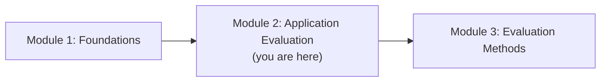
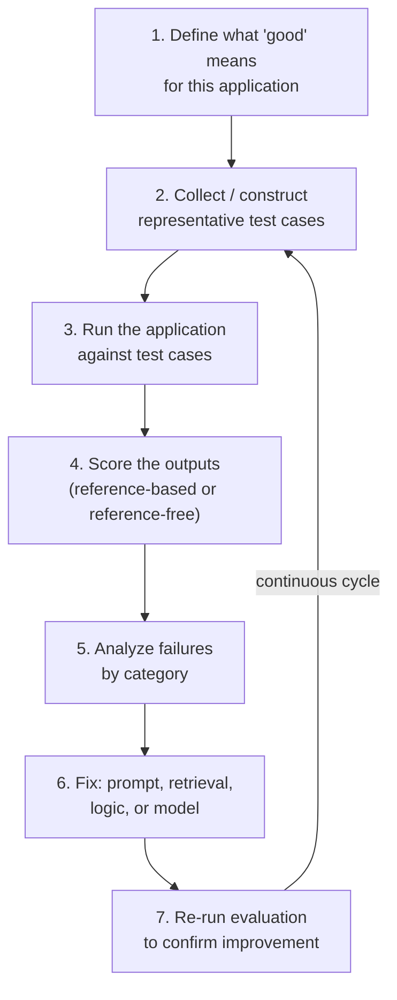
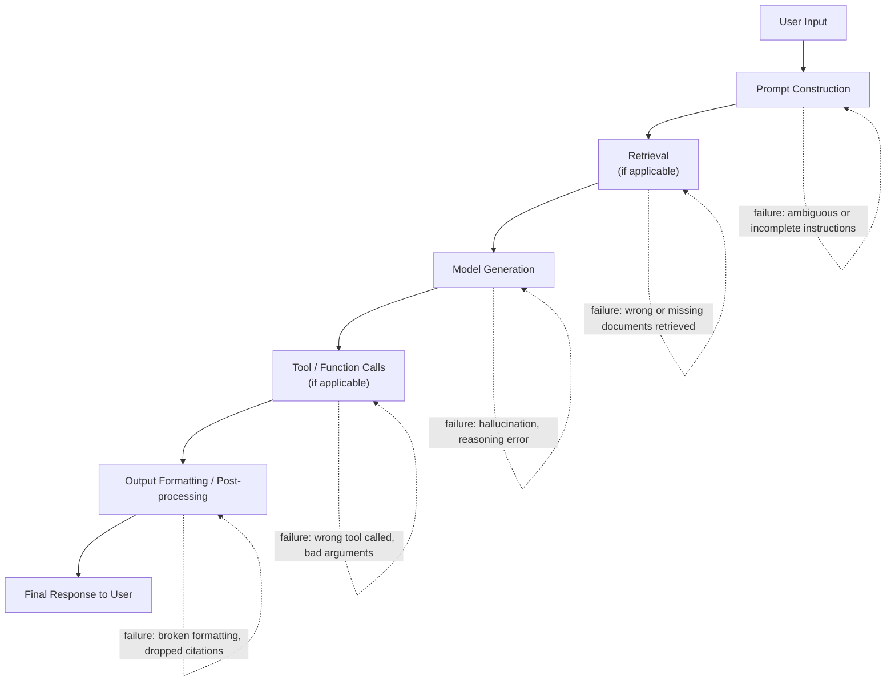
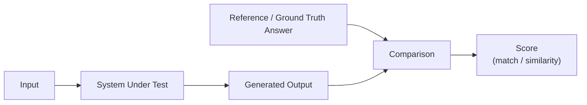
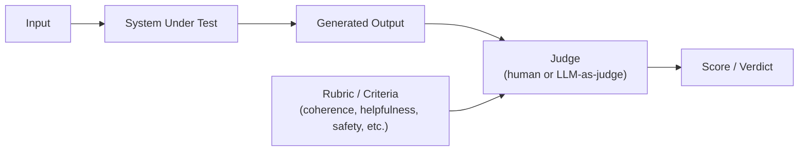
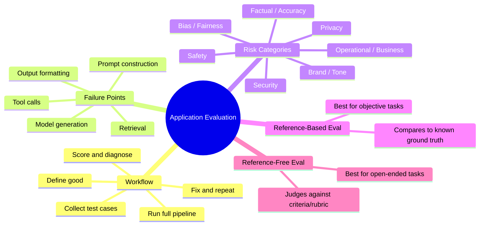

# Module 2 — Application Evaluation

> **Module Goal:** Go deep on evaluating LLM-powered *applications* — the full system a user actually interacts with. By the end of this module, you should understand the end-to-end application evaluation workflow, know how to identify where LLM applications fail, categorize the risk of those failures, and understand the difference between reference-based and reference-free evaluation.

---

## 📍 Where This Fits

Module 1 established the distinction between model evaluation and application evaluation. This module goes all-in on the application side — the layer most AI/product engineers actually work in day-to-day.

---

## 1. The LLM Application Evaluation Workflow

### Intuition

Imagine you've just built a customer support assistant. It's tempting to think of "evaluating" it as a single step: run it, check if the answers look good, ship it.

But a real LLM application isn't one thing — it's a pipeline. There's a prompt template, maybe a retrieval step pulling in company documents, maybe a tool call to check an order status, and finally the model generating a response. Any one of those stages can go wrong, and a single end-to-end check will only tell you *that* something failed — not *where* or *why*.

Application evaluation is a **workflow**, not a single check, precisely because the system you're evaluating is a pipeline, not a single function call.

### Definition

The **LLM Application Evaluation Workflow** is the repeatable process of defining what "good" looks like for a specific application, collecting representative test cases, running the application against them, scoring the outputs, and using the results to drive improvement — repeated continuously over the life of the product.

### The Workflow, Step by Step

1. **Define what "good" means.** Before you can measure quality, you need a concrete definition — is a "good" support answer accurate, on-brand, policy-compliant, and concise? Different applications will weigh these differently.
2. **Collect representative test cases.** Real or realistic inputs that reflect what actual users will send — not just the easy, obvious examples.
3. **Run the application.** Push those test cases through the *entire* pipeline, not just the raw model.
4. **Score the outputs.** Using reference-based or reference-free methods (covered later in this module).
5. **Analyze failures by category.** Not just "it failed," but *why* — was it a retrieval miss, a reasoning error, an unsafe response?
6. **Fix the responsible component.** The fix might not even involve the model — it could be a prompt tweak, a retrieval improvement, or a business-logic guardrail.
7. **Re-run and repeat.** Evaluation isn't a gate you pass once — it's a loop that runs continuously (we expand on this fully in Module 4).

### Why It Exists

Without a defined workflow, evaluation becomes ad hoc — different people testing different things in different ways, with no way to compare results over time or trust that "it got better" actually means anything. A workflow turns evaluation into an *engineering process* with the same rigor you'd expect from any other part of the system.

### Real-World Analogy

Think of this workflow like a **restaurant's quality control process**, not a single taste test. A well-run kitchen doesn't just have the head chef randomly taste a dish once. It defines standards (What does "correctly seasoned" mean for this dish?), tests consistently across dishes and shifts, tracks *which* stations produce problems (was it the sauce station or the grill?), and continuously refines the process — rather than hoping quality holds by chance.

### Practical Example

For a legal-document Q&A application, the workflow might look like:

1. **Define good:** Answers must be factually grounded in the source document, cite the relevant clause, and refuse to answer if the document doesn't cover the question.
2. **Collect test cases:** A mix of real anonymized user questions and deliberately tricky edge cases (questions the document doesn't answer, ambiguous phrasing, multi-part questions).
3. **Run the pipeline:** Retrieval → prompt construction → model generation → citation formatting.
4. **Score:** Check factual grounding against the source document (reference-based), and separately check tone and clarity (reference-free).
5. **Analyze:** Discover that most failures come from retrieval missing the right clause, not from the model reasoning poorly.
6. **Fix:** Improve the retrieval/chunking strategy, not the model or prompt.
7. **Re-run:** Confirm the fix actually reduced the specific failure category.

### Industry Use Case

Product teams building AI features typically maintain a **living eval set** — a growing collection of test cases, often seeded from real production failures — that gets run every time a prompt, model, or pipeline component changes, similar to how a regression test suite is run before every code deploy.

### Common Mistakes

- Testing only the "happy path" — inputs the system was obviously designed to handle well.
- Evaluating the model in isolation when the actual failures are happening in retrieval or business logic.
- Treating evaluation as a one-time pre-launch checklist item instead of a recurring workflow.

### Interview Questions

- Walk me through how you'd design an evaluation workflow for a new LLM feature.
- Why is it important to evaluate the *entire* application pipeline, not just the model's raw output?
- How would you decide what test cases to include in an application eval set?

### Key Takeaways

- Application evaluation is a repeatable, multi-step workflow — not a single manual check.
- The workflow spans defining "good," collecting cases, running the full pipeline, scoring, diagnosing, fixing, and repeating.
- Because the application is a pipeline, failures need to be traced to a *specific stage*, not attributed vaguely to "the AI."

---

## 2. Failure Points

### Intuition

If you only look at final outputs, every failure looks the same: "the answer was wrong." But in a real pipeline, wrong answers can originate from very different places — and the fix for each is completely different.

Think of an LLM application like an assembly line. If a defective product comes off the end of the line, you don't just say "the factory is broken" — you trace it back to the specific station: was it a bad part, a machine miscalibration, or a worker error? LLM applications need the same diagnostic mindset.

### Definition

A **Failure Point** is a specific stage in an LLM application's pipeline where an error can be introduced, leading to an incorrect, unsafe, or low-quality final output.

### Common Failure Points in an LLM Application

| Failure Point | What Can Go Wrong | Example |
|---|---|---|
| **User input handling** | Ambiguous, malformed, or adversarial input isn't handled gracefully | A user asks a vague follow-up question that loses prior context |
| **Prompt construction** | Instructions are unclear, contradictory, or missing key context | The prompt doesn't tell the model what to do if data is missing |
| **Retrieval** | Wrong, incomplete, or outdated documents are retrieved | A support bot retrieves an old pricing policy instead of the current one |
| **Model generation** | Hallucination, reasoning errors, tone mismatch | The model invents a policy that doesn't exist |
| **Tool / function calls** | Wrong tool selected, incorrect arguments passed | The model calls a "cancel order" function instead of "check order status" |
| **Output formatting / post-processing** | Citations dropped, formatting broken, unsafe content not filtered | A generated answer loses its source citation during rendering |

### Why It Exists (As a Concept)

Naming and cataloging failure points turns vague debugging ("the AI said something wrong") into precise engineering ("retrieval returned the wrong document 40% of the time on billing questions"). This precision is what makes it possible to actually fix the right thing.

### Real-World Analogy

This is like debugging a **factory production line** rather than just staring at the defective final product. You install checkpoints at each station — incoming materials, assembly, painting, packaging — so that when something goes wrong, you know exactly which station to investigate, instead of shutting down the entire line to search blindly.

### Practical Example

A user asks a travel-booking assistant: *"Can I get a refund for my flight next week?"*

The final answer is wrong — it says no refund is possible when one actually is. Without knowing failure points, all you can say is "the bot got it wrong." With failure-point analysis, you can trace it precisely:

- Was the correct refund policy **retrieved**? (Retrieval failure point)
- Did the **model** correctly reason from that policy to the user's specific ticket type? (Model generation failure point)
- Did a **tool call** to check the actual booking status fail or get skipped? (Tool call failure point)

Each answer points to a different fix.

### Industry Use Case

Companies operating production LLM pipelines often instrument **each stage separately** — logging retrieval hit rates, tool-call success rates, and model output quality independently — so that when overall quality dips, engineers can immediately localize the failure point instead of re-testing the entire system from scratch.

### Common Mistakes

- Attributing every bad output to "the model," even when the model behaved reasonably given bad retrieved context.
- Not logging intermediate pipeline stages, making it impossible to diagnose *where* a failure occurred after the fact.
- Fixing the wrong stage — e.g., tweaking prompts extensively when the real problem is a retrieval bug.

### Interview Questions

- What are the common failure points in a RAG (retrieval-augmented generation) pipeline?
- How would you diagnose whether a wrong answer came from retrieval or from the model's reasoning?
- Why is it important to log intermediate steps in an LLM application, not just final outputs?

### Key Takeaways

- LLM application failures happen at specific, identifiable pipeline stages — not as one undifferentiated "AI is wrong" event.
- Naming failure points transforms debugging from guesswork into targeted engineering.
- Effective evaluation requires visibility into *every* stage of the pipeline, not just the final output.

---

## 3. Risk Categories

### Intuition

Not all failures are equally dangerous. A chatbot that occasionally uses a slightly awkward phrase is a minor annoyance. A chatbot that gives incorrect medical dosage information is a serious, potentially harmful failure. Treating all failures as equally important wastes effort on trivial issues while under-investing in the ones that could cause real damage.

Risk categorization exists to help teams **triage** — to know which failures deserve urgent attention and which can be tracked but deprioritized.

### Definition

A **Risk Category** is a classification of a potential failure based on the severity and nature of its consequences, used to prioritize evaluation effort and remediation.

### Common Risk Categories

| Risk Category | Description | Example |
|---|---|---|
| **Factual / Accuracy Risk** | The output contains incorrect information presented as fact | Model states a wrong statistic or invents a fake citation |
| **Safety Risk** | The output could cause real-world harm | Unsafe medical, legal, or financial advice |
| **Bias / Fairness Risk** | The output reflects or amplifies unfair bias | Systematically different quality of response across demographic groups |
| **Privacy Risk** | The output leaks sensitive or personal information | Model reveals data it shouldn't have access to or infers private details |
| **Brand / Tone Risk** | The output is technically correct but damages brand trust | An overly casual or inappropriate tone in a formal financial context |
| **Operational / Business Risk** | The output leads to costly real-world actions | The assistant promises a refund the company didn't authorize |
| **Security Risk** | The output can be manipulated into unsafe behavior | The model is tricked into ignoring its safety instructions via a crafted prompt |

### Why It Exists

Engineering time and evaluation effort are finite. Risk categorization lets teams answer: *if we can only fix five things before launch, which five matter most?* It also shapes how evaluation itself is designed — a high-safety-risk application needs far more adversarial and edge-case testing than a low-stakes internal tool.

### Real-World Analogy

This mirrors how hospitals **triage patients in an emergency room**. A patient with a life-threatening injury is treated before someone with a minor scrape, even if the scrape patient arrived first. Risk categorization applies that same triage logic to AI failures — severity determines priority, not order of discovery.

### Practical Example

A financial-advice chatbot might classify failures like this:

- **Highest priority (Safety + Operational Risk):** The bot recommends an investment action based on a hallucinated market fact.
- **Medium priority (Accuracy Risk):** The bot gets a minor historical stock price wrong in a casual conversation.
- **Lower priority (Brand/Tone Risk):** The bot's phrasing is slightly too casual for a wealth-management context.

All three are failures. Only one of them justifies blocking a release.

### Industry Use Case

Regulated industries — healthcare, finance, legal — often formalize risk categorization into compliance frameworks, requiring that any deployment above a certain risk threshold undergo more rigorous evaluation, human review, or sign-off before release. Even outside regulated industries, mature AI teams use informal versions of this same triage system.

### Common Mistakes

- Treating all evaluation failures as equally urgent, leading to wasted effort or, worse, missed critical issues buried among minor ones.
- Failing to define risk categories *before* evaluation, resulting in inconsistent judgment calls about what's "serious."
- Ignoring risk categories that are hard to measure automatically (like bias) simply because they're harder to test than factual accuracy.

### Interview Questions

- How would you prioritize which failure types to fix first in an LLM application with limited engineering time?
- What risk categories would you consider for a healthcare-related LLM application specifically?
- How does the appropriate rigor of evaluation change based on an application's risk profile?

### Key Takeaways

- Not all failures carry equal consequences — risk categorization enables prioritization.
- Categories typically include factual, safety, bias/fairness, privacy, brand/tone, operational, and security risk.
- High-risk applications (healthcare, finance, legal) require proportionally more rigorous evaluation.

---

## 4. Reference-Based Evaluation

### Intuition

Sometimes there's a clear "correct answer" you can compare against — a known fact, a canonical translation, a specific number. In these cases, evaluation is straightforward: does the output match (or closely approximate) the known-correct reference?

This is the most intuitive form of evaluation, because it mirrors how we grade a math test: check the answer against the answer key.

### Definition

**Reference-Based Evaluation** measures an output by comparing it against a known correct answer (a "reference" or "ground truth"), using exact match, fuzzy match, or similarity-based scoring.

### Why It Exists

Reference-based evaluation exists because, for a meaningful subset of tasks, ground truth *does* exist and can be defined in advance — factual Q&A, translation, structured data extraction, classification. In these cases, comparing against ground truth gives an objective, highly trustworthy score.

### How It Works

### Practical Example

- **Task:** Extract the invoice total from a scanned document.
- **Reference:** The known correct total, `$4,582.00`.
- **Scoring:** Exact string match (or numeric match after normalization).

Or, for a less rigid case:

- **Task:** Translate a sentence from French to English.
- **Reference:** A professionally translated version of the sentence.
- **Scoring:** Similarity scoring (since an exact string match is too strict — multiple valid translations exist), comparing the model's output to the reference using a similarity measure.

### Industry Use Case

Reference-based evaluation is heavily used for tasks with objectively correct answers: structured data extraction, code correctness (does the code pass known test cases?), factual Q&A benchmarks, and classification tasks. Many of the major public benchmarks covered in Module 7, like MMLU, are fundamentally reference-based — each question has a known correct answer.

### Common Mistakes

- Using strict exact-match scoring for tasks where multiple correct answers are legitimately possible (like open-ended summarization), producing artificially low scores.
- Assuming a reference answer is always available — many real-world application tasks (open-ended chat, creative writing, subjective recommendations) simply don't have one.
- Not accounting for formatting differences (capitalization, whitespace, phrasing) that make a technically correct answer fail a naive exact-match check.

### Interview Questions

- When is reference-based evaluation the right choice, and when does it break down?
- How would you handle a task where multiple different outputs could all be considered "correct"?
- What's the risk of using strict exact-match scoring on an open-ended generation task?

### Key Takeaways

- Reference-based evaluation compares outputs against a known correct answer.
- It works best for tasks with objective ground truth: factual Q&A, extraction, translation, classification, code correctness.
- It breaks down for open-ended tasks where no single correct answer exists — which is exactly where reference-free evaluation comes in.

---

## 5. Reference-Free Evaluation

### Intuition

Now consider a task like: *"Write a friendly, professional email declining a meeting request."*

There is no single correct email. Dozens of different emails could all be excellent. Comparing against one fixed "reference" email would unfairly penalize perfectly good — but differently worded — outputs.

For tasks like this, you need a different approach: judge the output on its own merits, against a set of quality criteria, without requiring it to match any specific pre-written answer.

### Definition

**Reference-Free Evaluation** measures the quality of an output directly against a set of criteria or rubric — coherence, helpfulness, correctness, tone, safety — without comparing it to a single fixed "correct" reference answer.

### Why It Exists

A huge portion of real LLM application use cases are inherently open-ended: chat responses, creative writing, summarization (where many valid summaries exist), recommendations, brainstorming. Reference-free evaluation exists because these tasks have no fixed correct answer to compare against — yet they absolutely still need to be evaluated.

### How It Works

Note that reference-free evaluation still requires *some* standard to judge against — it's just a rubric or set of criteria rather than one fixed correct string. The judge doing the scoring can be a human, a rule-based check, or another model acting as a judge (covered fully in Module 3).

### Practical Example

- **Task:** "Summarize this news article in three sentences."
- **No single reference exists** — many different three-sentence summaries could be equally valid.
- **Evaluation criteria instead:** Does the summary accurately reflect the article's key points? Is it free of hallucinated details? Is it appropriately concise? Is the tone neutral?

A reference-free evaluator (human or model) checks the output against *these criteria* directly, rather than against one fixed "correct" summary.

### Industry Use Case

Reference-free evaluation is the dominant approach for evaluating conversational assistants, creative writing tools, and any open-ended generation feature — precisely the kind of product most consumer-facing LLM applications are. It's also the foundation of "LLM-as-a-judge" evaluation, which we'll cover in depth in the next module.

### Common Mistakes

- Assuming reference-free evaluation is "less rigorous" than reference-based — in practice it's often *harder* to do well, because it requires carefully designed rubrics and reliable judges.
- Using vague, undefined criteria ("is it good?") instead of specific, checkable criteria (accuracy, tone, safety, completeness), leading to inconsistent scoring.
- Forgetting that a reference-free judge (human or model) can itself be biased or inconsistent — the quality of the judge directly determines the quality of the evaluation.

### Interview Questions

- Why can't tasks like open-ended summarization or chat be evaluated using reference-based methods?
- What makes a good rubric for reference-free evaluation?
- What are the risks of using reference-free evaluation, and how would you mitigate them?

### Key Takeaways

- Reference-free evaluation judges outputs against criteria or a rubric, not a single fixed correct answer.
- It's essential for open-ended tasks — chat, summarization, creative writing — where no single "correct" output exists.
- Its accuracy depends heavily on the quality of the judge and the clarity of the rubric, which is why judge selection (human vs. LLM-as-a-judge) matters so much — the focus of Module 3.

---

## 📌 Module 2 Summary

This module gave you the full toolkit for thinking about **application-level evaluation**: the workflow that ties everything together, how to trace failures to specific pipeline stages, how to prioritize those failures by risk, and the two fundamental evaluation paradigms — reference-based and reference-free.

Module 3 goes deeper into the **methods** used to actually carry out these evaluations: programmatic checks, deterministic rules, human evaluation, and LLM-as-a-judge — including a full comparison of when to use each.

---

