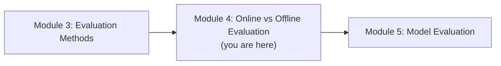
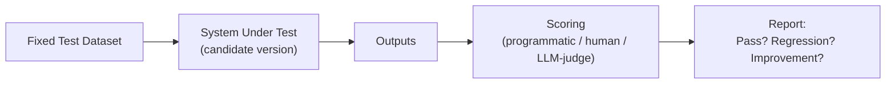
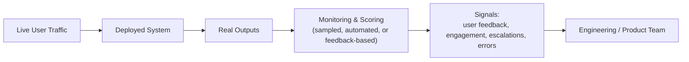
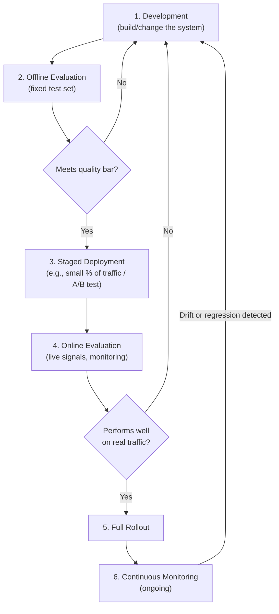
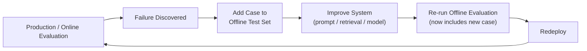
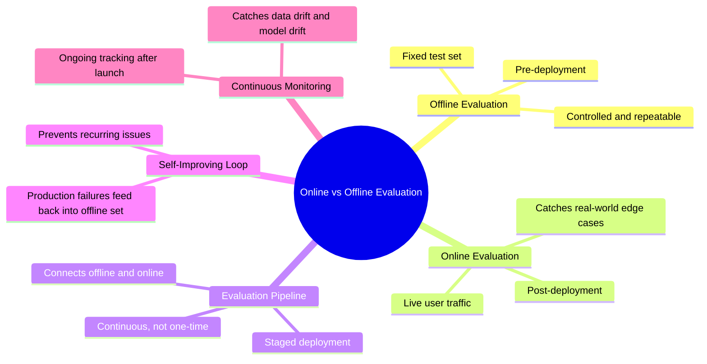

# Module 4 — Online vs. Offline Evaluation

> **Module Goal:** Understand *when* and *where* in the product lifecycle evaluation happens. By the end of this module, you should be able to explain offline vs. online evaluation, describe what a full evaluation pipeline looks like, and understand how self-improving loops and continuous monitoring keep an LLM system reliable long after launch.

---

## 📍 Where This Fits

Module 3 gave you the toolkit for *scoring* an output. This module answers a different question: at what point in a system's life should you actually be running that scoring — before you ship, after you ship, or both?

---

## 1. Offline Evaluation

### Intuition

Before a new car model is ever sold to a customer, it's tested extensively in a controlled environment — crash tests, wind tunnels, test tracks. None of this happens with real customers driving real roads; it happens in a lab, using data and conditions the manufacturer controls.

**Offline evaluation** is the equivalent for LLM systems: testing against a fixed, curated dataset, in a controlled environment, before real users are ever exposed to the system (or a change to it).

### Definition

**Offline Evaluation** is the process of evaluating a model or application against a static, predefined set of test cases, disconnected from live user traffic — typically run during development, before deployment, or before rolling out a change.

### Why It Exists

Offline evaluation exists because you need a way to catch failures *before* they reach real users. It's controlled and repeatable: the same test set can be run against different model versions, different prompts, or different pipeline configurations, giving you a clean, apples-to-apples comparison that live traffic — messy, unpredictable, and different every time — can't provide.

### How It Works

### Real-World Analogy

Offline evaluation is exactly like a **dress rehearsal** before opening night. The performance happens in full, under realistic conditions, but without a live audience — so any mistakes can be caught and fixed before they affect a real customer's experience.

### Practical Example

Before rolling out a new prompt for a support chatbot, the team runs it against a curated set of 500 historical support questions (the offline test set), checking:

- Does response accuracy stay the same or improve compared to the old prompt?
- Does the new prompt introduce any new failure patterns on tricky edge cases already in the test set?

Only after the new prompt performs at least as well as the old one offline does it get considered for release.

### Industry Use Case

Offline evaluation sets are the backbone of any serious **pre-release testing process** — similar in spirit to a regression test suite in traditional software, but scored using the mixed toolkit from Module 3 (programmatic, deterministic, human, and LLM-as-a-judge methods) rather than simple pass/fail assertions.

### Common Mistakes

- Letting the offline test set go stale — if it doesn't reflect how real users actually use the system, passing it offline won't predict success in production.
- Overfitting the system to the offline test set specifically (tuning prompts *to* the test cases rather than to genuine underlying quality), which inflates offline scores without improving real-world performance.
- Treating a passing offline evaluation as a guarantee of production success, rather than as a strong — but incomplete — signal.

### Interview Questions

- What is offline evaluation, and why is it run before deployment?
- What's the risk of a static offline test set becoming outdated?
- How would you prevent a system from being "overfit" to an offline eval set?

### Key Takeaways

- Offline evaluation runs against a fixed, controlled dataset, disconnected from live traffic.
- It enables clean, repeatable comparisons between versions before anything reaches real users.
- Its usefulness depends entirely on how well the test set reflects real-world usage — a stale or narrow test set gives a false sense of security.

---

## 2. Online Evaluation

### Intuition

No matter how good your offline test set is, it can never perfectly predict what will happen when real users — with all their unpredictability, creativity, and edge cases you never thought to test — start using the system for real.

**Online evaluation** picks up where offline evaluation leaves off: measuring how the system actually performs against real, live traffic, after it's been deployed.

### Definition

**Online Evaluation** is the process of evaluating a model or application's performance using real, live user interactions and outcomes, after deployment, rather than a static predefined dataset.

### Why It Exists

Real-world usage always includes patterns, phrasing, and edge cases that no offline test set fully anticipates. Online evaluation exists to catch what offline evaluation structurally can't: genuinely novel failure modes, shifts in user behavior over time, and the real-world consequences of the system's decisions.

### How It Works

Online evaluation typically draws on signals like:

- **Explicit user feedback** — thumbs up/down, ratings, complaints
- **Implicit behavioral signals** — did the user rephrase the question (a sign the first answer failed)? Did they escalate to a human agent?
- **Sampled automated scoring** — running a subset of live outputs through programmatic or LLM-as-a-judge scoring in near-real time
- **Business outcome metrics** — resolution rate, conversion rate, task completion rate

### Real-World Analogy

If offline evaluation is the dress rehearsal, online evaluation is **opening night, every night** — watching how the real audience actually reacts, which jokes land, which scenes fall flat, and adjusting based on what genuinely happens in front of a live crowd, not just what a rehearsal predicted.

### Practical Example

After the new support chatbot prompt passes offline evaluation and is deployed, the team monitors:

- The rate of users clicking "this didn't help" over the following two weeks
- Whether escalations to human agents increased or decreased
- A daily sample of live conversations run through an LLM-as-a-judge check for tone and accuracy

If any of these signals degrade, it's a sign that something offline evaluation missed is happening in the real world.

### Industry Use Case

Companies running LLM products at scale often run **A/B tests** as a form of online evaluation — deploying a new model or prompt to a small percentage of real traffic, comparing outcome metrics against the existing version, and only rolling out further if the new version performs better on real, live signals.

### Common Mistakes

- Relying exclusively on offline evaluation and skipping online monitoring entirely, missing failures that only appear in real usage.
- Not distinguishing between correlation and causation in online signals (e.g., a drop in engagement might reflect a broader trend, not a model regression).
- Waiting too long to review online signals, allowing a real problem to affect many users before it's caught.

### Interview Questions

- Why is offline evaluation alone insufficient for a production LLM system?
- What signals would you monitor to catch a real-world failure that an offline test set missed?
- How would you design an A/B test to safely roll out a new model version?

### Key Takeaways

- Online evaluation measures real-world performance using live traffic, after deployment.
- It catches failure modes that offline test sets structurally cannot anticipate.
- It relies on a mix of explicit feedback, implicit behavioral signals, sampled scoring, and business outcome metrics.

---

## 3. Evaluation Pipeline

### Intuition

Offline and online evaluation aren't two separate, disconnected activities — they're two stages of a single, continuous **pipeline** that spans the entire life of an LLM system, from initial development through to years of production operation.

### Definition

An **Evaluation Pipeline** is the end-to-end, connected system of offline and online evaluation stages, through which every change to a model, prompt, or application must pass — from initial development, through pre-release testing, to post-deployment monitoring.

### The Full Pipeline

### Why It Exists

Without a connected pipeline, offline and online evaluation become disjointed, ad hoc activities — someone runs an offline check once, ships, and hopes for the best, with no structured connection back to monitoring or the next development cycle. A defined pipeline ensures every change is evaluated consistently, at every relevant stage, and that findings feed back into further development.

### Real-World Analogy

An evaluation pipeline is like an **aircraft's certification and operational process**: rigorous ground testing (offline), followed by limited test flights (staged deployment), followed by full commercial operation under constant monitoring (online + continuous monitoring) — with any anomaly at any stage sending the aircraft back for further evaluation before it flies passengers again.

### Practical Example

A team wants to switch their support chatbot to a new underlying model version:

1. **Development:** Update the pipeline to use the new model.
2. **Offline evaluation:** Run the existing 500-question test set; compare scores to the current model.
3. **Gate:** New model must match or beat the current model on every risk category from Module 2 before proceeding.
4. **Staged deployment:** Roll out to 5% of live traffic.
5. **Online evaluation:** Monitor thumbs-down rate, escalation rate, and sampled LLM-as-a-judge scores for two weeks.
6. **Full rollout:** If online signals hold steady or improve, roll out to 100% of traffic.
7. **Continuous monitoring:** Keep watching indefinitely — usage patterns and content can shift over time.

### Industry Use Case

Mature AI engineering teams treat the evaluation pipeline the same way mature software teams treat CI/CD — as non-negotiable infrastructure that every change passes through, rather than a manual, optional step someone remembers to do occasionally.

### Common Mistakes

- Building strong offline evaluation but no connection to online monitoring, so real-world regressions go undetected.
- Skipping staged deployment and rolling changes out to 100% of traffic immediately, removing the safety net of limited-exposure testing.
- Treating the pipeline as a one-time setup rather than something that itself needs to evolve as the product and its risks evolve.

### Interview Questions

- Describe the stages of a complete LLM evaluation pipeline, from development to production monitoring.
- Why is staged deployment (e.g., rolling out to a small percentage of traffic first) valuable?
- How should findings from online evaluation feed back into the development process?

### Key Takeaways

- The evaluation pipeline connects offline and online evaluation into one continuous, staged process.
- Staged deployment (testing on a small percentage of real traffic before full rollout) reduces the blast radius of undetected issues.
- A pipeline is infrastructure, not a one-time checklist — it should be maintained and evolved over the life of the product.

---

## 4. Self-Improving Loop

### Intuition

The most mature evaluation systems don't just catch problems — they use every discovered failure as fuel to make the *evaluation itself* better over time. A production failure that slipped past offline evaluation isn't just a bug to fix; it's a sign that the offline test set had a blind spot — and that blind spot should be closed.

### Definition

A **Self-Improving Loop** is a feedback cycle in which failures discovered during online evaluation (or in production more broadly) are fed back into the offline evaluation set and the development process, so the system's ability to catch similar failures improves continuously over time.

### How It Works

### Why It Exists

Without this loop, the same category of failure can recur indefinitely — discovered in production, patched informally, and never actually added to the systematic test suite, so a future change can silently reintroduce the exact same bug. The self-improving loop turns every production failure into a permanent, lasting improvement to the evaluation process itself.

### Real-World Analogy

This mirrors how **aviation safety improves after incidents**. Every real-world incident is investigated, and the findings are converted into new checks, procedures, or training that become part of the *permanent* safety process going forward — not just a one-off fix for that single flight.

### Practical Example

A user tricks the support chatbot into revealing internal pricing logic it shouldn't disclose. The team:

1. Fixes the immediate issue (a prompt/guardrail update).
2. Adds this exact scenario — and several variations of it — to the **offline test set** as a permanent regression case.
3. From this point forward, every future change to the chatbot is automatically checked against this scenario before it can ship again.

The system has now permanently "learned" from this failure, not just patched around it once.

### Industry Use Case

Teams practicing this well maintain what's often called a **"living" or "growing" eval set** — one that expands continuously as new failure modes are discovered in production, rather than a fixed set written once at the start of the project and never revisited.

### Common Mistakes

- Fixing production issues without ever adding a corresponding case to the offline test set, allowing the same bug class to resurface later.
- Letting the offline test set grow without pruning or organizing it, making it slow and unwieldy to run.
- Treating each production failure as an isolated incident rather than asking "what *category* of failure does this represent, and what other similar cases should we add?"

### Interview Questions

- What is a self-improving evaluation loop, and why is it valuable?
- If a production failure is discovered and fixed, what should happen next in a mature evaluation process?
- How would you prevent an offline test set from becoming unmanageably large as it grows over time?

### Key Takeaways

- A self-improving loop feeds real-world failures back into the offline evaluation set, so the system permanently gets better at catching that category of issue.
- Without this loop, the same failure types can silently recur across future changes.
- Mature teams treat their offline eval set as a living artifact that grows with every real-world lesson learned.

---

## 5. Continuous Monitoring

### Intuition

Even after a system passes every offline check, survives staged rollout, and performs well in early online evaluation, it doesn't stay static. User behavior shifts, the world changes (new events, new slang, new products), and the underlying model itself might be silently updated by its provider. **Continuous monitoring** exists because "it worked when we launched it" is not the same as "it still works today."

### Definition

**Continuous Monitoring** is the ongoing, indefinite tracking of a deployed LLM system's performance and behavior in production, used to detect regressions, drift, or emerging failure patterns after the initial rollout is complete.

### Why It Exists

Two forces make continuous monitoring necessary even for a system that launched successfully:

1. **Data drift** — the kinds of questions, topics, or user behavior the system encounters can shift meaningfully over time (seasonality, new product launches, current events).
2. **Model drift** — if the underlying model is hosted by a third party, its behavior can change with silent updates, even without any change on the application team's side.

Without continuous monitoring, a system can silently degrade for weeks before anyone notices — because nobody is *looking* after the initial launch celebration ends.

### What Gets Monitored

| Signal Type | Example |
|---|---|
| **Quality metrics** | Sampled LLM-as-a-judge or human-reviewed scores on live traffic, tracked over time |
| **User feedback trends** | Thumbs-down rate, complaint volume, escalation rate |
| **Business outcomes** | Resolution rate, conversion rate, retention |
| **Operational health** | Latency, error rate, cost per interaction |
| **Distribution shifts** | Are the *kinds* of questions users ask changing over time? |

### Real-World Analogy

Continuous monitoring is like a **hospital patient hooked up to vital-sign monitors** after a successful surgery. The surgery going well doesn't mean monitoring stops — vitals are tracked continuously afterward, because complications can emerge later, and catching them early makes all the difference.

### Practical Example

Three months after a successful chatbot launch, continuous monitoring detects a gradual rise in escalation rate for questions about a specific product line. Investigation reveals the company recently changed that product's return policy, and the chatbot's retrieved documents haven't been updated — a failure that offline evaluation from three months ago could never have caught, because the world itself changed.

### Industry Use Case

Production AI teams typically build **dashboards and automated alerting** around these monitoring signals — similar to how traditional software teams monitor uptime and error rates — so that degradation is caught within hours or days, not discovered accidentally weeks later through user complaints.

### Common Mistakes

- Treating monitoring as a one-time setup rather than an evolving system that itself needs occasional review.
- Monitoring only technical metrics (latency, error rate) while ignoring quality and outcome metrics, missing subtle degradation in the actual user experience.
- Not setting clear thresholds or alerts, so degradation is technically visible in a dashboard but never actually acted on until a serious complaint arrives.

### Interview Questions

- Why is continuous monitoring necessary even after a system has passed all pre-launch evaluation?
- What's the difference between "data drift" and "model drift," and why do both matter?
- What signals would you put on a monitoring dashboard for a production LLM application?

### Key Takeaways

- Continuous monitoring tracks a deployed system indefinitely, because passing launch evaluation doesn't guarantee lasting reliability.
- Data drift (changing user behavior) and model drift (silent provider-side changes) are two reasons systems can degrade after launch.
- Effective monitoring covers quality, feedback, business outcomes, and operational health — not just technical uptime.

---

## 📌 Module 4 Summary

You now understand the full **lifecycle** of LLM evaluation — from controlled, pre-launch offline testing, through staged rollout and online evaluation, to indefinite continuous monitoring, with a self-improving loop tying it all together so the system gets more robust over time rather than just staying static.

So far, this repository has focused heavily on **application-level** evaluation. Module 5 shifts the lens back to the **model itself** — why AI engineers, not just AI labs, need to understand model evaluation, and what model evaluation actually consists of.

---

