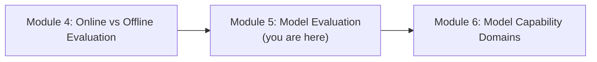
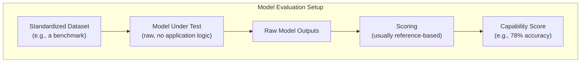
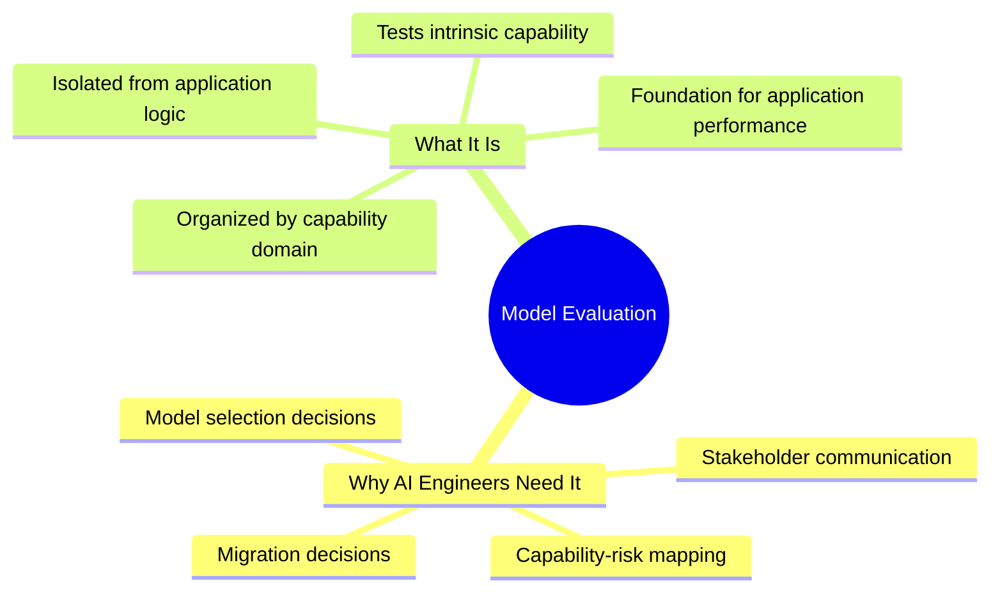

# Module 5 — Model Evaluation

> **Module Goal:** Shift the lens from the application layer back to the model itself. By the end of this module, you should understand why AI engineers — not just AI labs — need a working understanding of model evaluation, and what "model evaluation" actually means in practice.

---

## 📍 Where This Fits

Modules 2–4 focused on evaluating the *application* built around a model. This module returns to a distinction first introduced in Module 1 — model evals vs. application evals — and goes deep on the model side, setting up Module 6's tour of specific capability domains.

---

## 1. Why AI Engineers Need Model Evaluation

### Intuition

It's tempting for an AI engineer building a product to think: "Model evaluation is the AI lab's job — I just consume whatever model they release, and I focus entirely on my application layer." This is a comfortable assumption, and it's wrong.

Think about a chef choosing ingredients. A chef doesn't need to be a farmer, but they absolutely need to understand what makes a good tomato — ripeness, variety, growing conditions — because that knowledge directly determines what dishes are possible and how they'll turn out. An AI engineer doesn't need to *train* models, but they absolutely need to understand model evaluation, because it directly determines which model is the right foundation for their application.

### Definition

From the perspective of an AI engineer (rather than a model researcher), **understanding model evaluation** means being able to interpret, critically assess, and apply model-level evaluation results — benchmark scores, capability reports, safety evaluations — to make informed decisions about which model to build on and how to use it responsibly.

### Why It Matters

There are several concrete, practical reasons an AI engineer needs this fluency, not just a model researcher:

| Reason | Why It Matters in Practice |
|---|---|
| **Model selection** | Choosing between competing models for a specific product requires interpreting their evaluation results correctly, not just picking the one with the highest headline score |
| **Capability-risk mapping** | Understanding a model's weak spots (e.g., poor long-context performance) helps engineers design around them at the application layer |
| **Avoiding costly mistakes** | Misreading benchmark results can lead to shipping a model poorly suited to the actual task, discovered only after launch |
| **Communicating with stakeholders** | Engineers are often asked to justify model choices to product, legal, or leadership teams — this requires being able to explain what a benchmark score does and doesn't mean |
| **Migration decisions** | Deciding whether to upgrade to a new model version requires comparing model-level evaluation results, not just application-level vibes |

### Real-World Analogy

This is like a **structural engineer choosing building materials**. They don't need to run the steel mill, but they absolutely need to understand tensile strength ratings, fatigue limits, and failure modes for different materials — because a wrong or superficial reading of those specs can mean the difference between a safe building and a collapsed one.

### Practical Example

An AI engineer is deciding between two candidate models for a coding assistant feature. Model A has a slightly higher score on a general knowledge benchmark. Model B has a meaningfully higher score on a coding-specific benchmark. Without understanding what these benchmarks actually measure (covered in Module 6 and 7), the engineer might default to the model with the more impressive-*sounding* overall reputation — missing that Model B is clearly the better fit for this specific product.

### Industry Use Case

Engineering teams building AI products routinely maintain internal comparisons of model evaluation results across candidate models — not to redo the AI labs' work, but to correctly interpret and apply it to their specific decision: which model to use, where, and with what guardrails.

### Common Mistakes

- Assuming "the newest model" or "the model with the best overall reputation" is automatically the right choice for every task.
- Never reading past the headline benchmark score to understand what a benchmark actually tests (a mistake Module 7 addresses directly).
- Treating model evaluation as something entirely outside an application engineer's job, and therefore never developing the skill to interpret it critically.

### Interview Questions

- Why should an application engineer care about model evaluation results, even if they never train models themselves?
- Describe a scenario where picking the "best" model by an overall score led to a worse product outcome.
- How would you evaluate whether a specific model is well-suited to a specific product feature?

### Key Takeaways

- Model evaluation isn't exclusively an AI lab concern — application engineers need to interpret it to make good model-selection decisions.
- Understanding a model's capability profile helps engineers design applications that play to its strengths and route around its weaknesses.
- Misreading or ignoring model evaluation results is a common, costly mistake in real product development.

---

## 2. What Are Model Evaluations?

### Intuition

Recall the engine-vs-car analogy from Module 1: model evaluation is testing the engine on a bench, isolated from any specific vehicle it might end up in. Now let's define precisely what that "testing" actually consists of.

### Definition

**Model Evaluation** is the process of measuring a language model's intrinsic capabilities — its knowledge, reasoning, coding ability, safety behavior, and other properties — independent of any specific downstream application, typically using standardized tasks and datasets designed to isolate and measure those properties in a controlled, comparable way.

### Structure of a Model Evaluation

Notice what's *absent* compared to application evaluation (Module 2): no retrieval pipeline, no business logic, no tool calls, no product-specific prompt engineering. The model is tested in as close to isolation as possible, so the resulting score reflects the model's own capability — not the quality of some particular application built around it.

### What Model Evaluations Typically Cover

Model evaluations are usually organized around **capability domains** — distinct categories of ability that frontier labs test separately, because a model can be strong in one and weak in another. This is exactly the structure Module 6 explores in depth:

- Knowledge & Reasoning
- Coding & Software Engineering
- Mathematics
- Long Context
- Vision & Multimodal
- Agentic & Tool Use
- Safety & Alignment
- Instruction Following

### Why It Exists

Model evaluation exists to answer a narrower, more fundamental question than application evaluation: **independent of how it's used, how capable and reliable is this model, on its own?** This matters because it's the foundation everything else is built on — a weak foundation limits what any application built on top of it can ever achieve, no matter how well-engineered the application layer is.

### Real-World Analogy

Model evaluation is like **evaluating a musician's raw technical skill** — sight-reading ability, range, tone, timing — independent of any specific performance or song. A technically excellent musician might still give a mediocre performance if the song choice, arrangement, or venue is wrong (that's the application layer) — but you can't get a *great* performance out of a musician who lacks the underlying technical skill in the first place, no matter how well everything else around them is arranged.

### Practical Example

An AI lab releases a new model version. Before release, they measure:

- Its accuracy on a broad knowledge-and-reasoning benchmark
- Its score on coding-specific test suites
- Its performance on long-context retrieval tasks
- Its safety refusal rate on a set of adversarial prompts

None of these tests involve any specific product. They're testing the model itself — the same way a car engine is dyno-tested on a bench before it's ever installed in any particular car model.

### Industry Use Case

Every major model release from a frontier AI lab is accompanied by a "model card" or technical report presenting exactly this kind of evaluation — capability scores across multiple domains, safety evaluation results, and comparisons against prior versions or competing models. This is the primary way the industry communicates what a new model can actually do.

### Common Mistakes

- Confusing a strong model evaluation score with a guarantee of strong application performance (a mistake this entire repository works to correct, going back to Module 1).
- Assuming model evaluation is a single score, rather than a multi-dimensional profile across distinct capability domains.
- Ignoring safety and alignment evaluation results in favor of only looking at raw capability scores.

### Interview Questions

- What distinguishes model evaluation from application evaluation, structurally?
- Why do model evaluations typically avoid including application-specific logic like retrieval or tool use?
- Why is model evaluation reported as a profile across multiple capability domains rather than a single overall score?

### Key Takeaways

- Model evaluation measures a model's intrinsic capabilities in isolation, without any application-specific logic layered on top.
- It's typically organized into distinct capability domains, because models can be strong in some and weak in others.
- It forms the foundation that application performance is built on — necessary, but never sufficient on its own.

---

## 📌 Module 5 Summary

This module made the case that model evaluation isn't just an AI lab's concern — it's a skill every AI engineer needs, because it directly shapes model selection, risk awareness, and product decisions.

Module 6 is the deepest module in this repository: a full tour of every major **model capability domain** — knowledge & reasoning, coding, math, long context, vision & multimodal, agentic & tool use, safety & alignment, and instruction following — each covered with the same rigor: what it measures, why it matters, and how frontier labs evaluate it.

---
