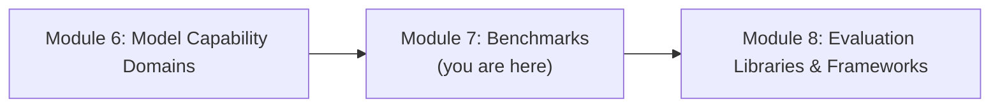
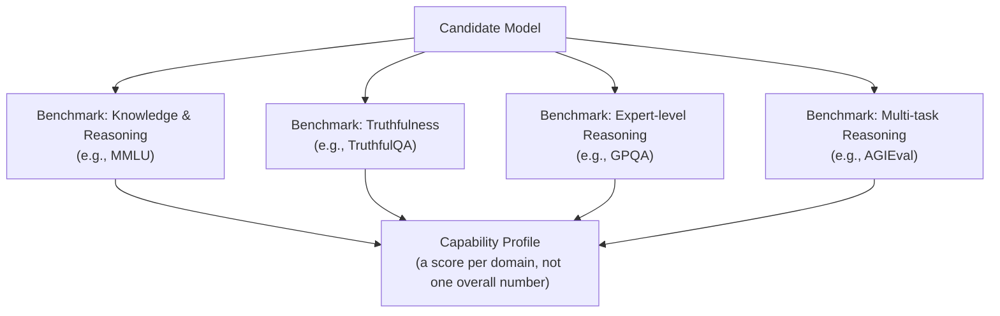
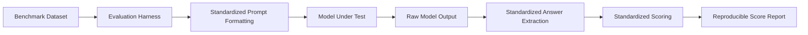
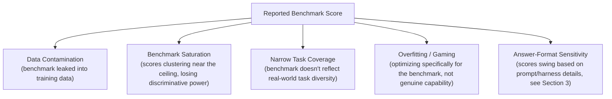
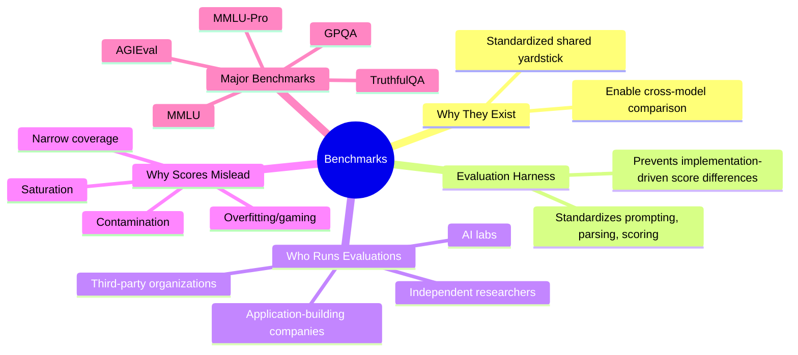

# Module 7 — Benchmarks

> **Module Goal:** Understand benchmarks as the standardized measurement instruments of the field. By the end of this module, you should know why benchmarks exist, how they're used to evaluate models, why an evaluation harness matters, who actually runs these evaluations, why benchmark scores can be misleading, and the specifics of five major benchmarks: MMLU, MMLU-Pro, TruthfulQA, GPQA, and AGIEval.

---

## 📍 Where This Fits

Module 6 covered the capability domains frontier labs evaluate. This module covers the actual standardized tools used to measure them.

---

## 1. Why Benchmarks Exist

### Intuition

Recall from Module 1: an eval is a measurement instrument. A **benchmark** is a specific kind of eval — one that's standardized, usually public, and used consistently across the entire industry so that different models can be compared on a level playing field.

Without benchmarks, comparing two models would be like comparing two students who each took a *different* exam, graded by *different* teachers, using *different* standards. You'd have two numbers, but no way to know if they actually mean the same thing.

### Definition

A **Benchmark** is a standardized, typically public evaluation — a fixed dataset paired with a fixed scoring methodology — designed to allow consistent, comparable measurement of a specific capability across different models, versions, and even different research teams.

### Why They Exist

Benchmarks exist to solve a coordination problem across an entire industry: everyone needs a shared, trusted yardstick. When a benchmark is public and standardized, a score reported by one lab means roughly the same thing as a score reported by another lab, enabling meaningful comparison, tracking progress over time, and holding claims accountable.

### Real-World Analogy

Benchmarks are like **standardized international units of measurement**. A kilogram means the same thing in every country, made possible by an agreed-upon, universal standard — not because every country independently decided to trust each other's local measurements. Benchmarks play that same role for model capability: a shared, trusted reference point.

### Practical Example

When a new model is released and its creators report "85% on [a widely used benchmark]," this number is only meaningful because that benchmark has a fixed, publicly known dataset and scoring method — allowing anyone to compare it directly against previously reported scores from other models on the exact same benchmark.

### Industry Use Case

Benchmark leaderboards — public rankings of different models' scores on the same standardized benchmarks — have become one of the primary ways the AI industry and research community track progress and compare competing models at a glance.

### Common Mistakes

- Treating a benchmark score as a complete measure of a model's real-world usefulness, rather than a narrow, standardized measurement of one specific capability.
- Assuming all benchmarks are equally rigorous or trustworthy (a concern explored fully later in this module).
- Ignoring that publicly known benchmarks can be gamed or leaked into training data, inflating scores without genuine capability improvement.

### Interview Questions

- Why do standardized, public benchmarks matter for comparing models across different labs?
- What's the risk of relying entirely on public benchmark scores to judge a model?
- How is a benchmark different from a general "eval," as defined in Module 1?

### Key Takeaways

- Benchmarks are standardized evals that enable fair, consistent comparison across models and labs.
- Their value comes specifically from being fixed and public — a shared yardstick everyone can trust.
- They're narrow, standardized instruments, not comprehensive measures of real-world usefulness.

---

## 2. Model Evaluation Using Benchmarks

### Intuition

Now let's connect this back to Module 5: how do labs actually use benchmarks to evaluate a model's capability profile in practice?

### Definition

**Model evaluation using benchmarks** is the practice of running a candidate model against one or more standardized benchmarks — each typically targeting a specific capability domain from Module 6 — to produce a comparable capability profile.

### How It Works

A single model is typically run against many benchmarks — each measuring a different capability domain — producing a multi-dimensional profile rather than one overall grade, echoing the point made repeatedly in Module 6: capability isn't one-dimensional.

### Why It Matters

This is how the abstract idea of "capability domains" (Module 6) actually gets turned into concrete numbers that can be tracked, compared, and reported. Without benchmarks, capability domains would remain conceptual categories with no way to measure progress within them.

### Practical Example

A model release report might show: 88% on a general knowledge benchmark, 92% on a coding benchmark, and 65% on an expert-level graduate-science benchmark. Together, these three numbers paint a much more useful picture than any single combined score could.

### Industry Use Case

This is standard practice for every frontier model release — a battery of benchmarks run across capability domains, reported together as a profile, often compared directly against the model's own predecessor and against competing models on the same set of benchmarks.

### Common Mistakes

- Averaging benchmark scores across very different domains into one meaningless composite number.
- Comparing two models on different benchmark sets rather than the same ones, making the comparison invalid.
- Failing to consider that benchmark performance can plateau or saturate over time as models improve (a topic explored further below).

### Interview Questions

- Why is it more useful to report a capability profile across multiple benchmarks than a single combined score?
- What issues arise from comparing two models using different benchmark suites?
- How would you decide which benchmarks are relevant for evaluating a model intended for a specific use case?

### Key Takeaways

- Benchmarks are used in batteries, spanning multiple capability domains, to build a comparable capability profile.
- A multi-dimensional profile is far more informative than a single composite score.
- Valid comparison requires using the *same* benchmarks across the models being compared.

---

## 3. Need for an Evaluation Harness

### Intuition

Running a model against a benchmark sounds simple in principle: give it the questions, check the answers. In practice, this requires a substantial amount of careful infrastructure — consistent prompting, consistent answer parsing, reproducible scoring — done correctly and identically every single time. This infrastructure is called an **evaluation harness**.

### Definition

An **Evaluation Harness** is the software infrastructure that manages the process of running a model against one or more benchmarks — handling prompt formatting, model querying, output parsing, scoring, and result reporting — in a consistent, reproducible way.

### Why It Exists

Without a standardized harness, subtle implementation differences — how a question is phrased in the prompt, how an answer is extracted from a model's free-form response, how partial credit is handled — can significantly change a benchmark score, even though the underlying model capability hasn't changed at all. A harness exists to eliminate this source of noise, ensuring that a reported score genuinely reflects the model, not an artifact of how the test was administered.

### How It Works

### Real-World Analogy

An evaluation harness is like the **standardized testing procedures** used for a driving exam — the same course layout, the same instructions, the same scoring criteria, administered identically to every test-taker. Without that standardization, you couldn't fairly compare whether one driver actually performed better than another, versus simply facing an easier test.

### Practical Example

Two teams evaluate the same model on the same benchmark, but one team formats the question prompt slightly differently and uses a looser method for extracting the model's final answer from its response. Their reported scores differ by several percentage points — not because the model behaved differently, but because their harnesses handled the process differently. A shared, standardized harness prevents this kind of discrepancy.

### Industry Use Case

Widely used open-source evaluation harnesses have become a standard part of the industry's evaluation infrastructure, allowing researchers and companies to run consistent, comparable benchmark evaluations without each building this infrastructure from scratch. We'll look at specific tools in Module 8.

### Common Mistakes

- Building ad hoc, custom evaluation scripts that subtly diverge from standard harness implementations, producing scores that aren't truly comparable to others reported publicly.
- Underestimating how much answer-extraction logic (parsing a model's free-form response into a gradable answer) can affect final scores.
- Assuming benchmark scores from different sources are directly comparable without checking whether they were produced using the same harness and methodology.

### Interview Questions

- Why can two teams get different benchmark scores for the same model?
- What role does an evaluation harness play in making benchmark results trustworthy?
- What parts of the evaluation process does a harness need to standardize to ensure reproducibility?

### Key Takeaways

- An evaluation harness standardizes prompt formatting, querying, answer extraction, and scoring.
- Without it, benchmark scores can vary due to implementation details rather than genuine model capability differences.
- Trustworthy, comparable benchmark results depend on consistent harness methodology, not just a shared dataset.

---

## 4. Who Runs Model Evaluations

### Intuition

It's worth being explicit about who's actually doing this work, since different parties run evaluations for different reasons, with different incentives and levels of scrutiny.

### The Main Players

| Who | Why They Run Evaluations |
|---|---|
| **AI labs (model creators)** | To validate progress internally, decide readiness for release, and report capability in model releases |
| **Independent research institutions** | To provide neutral, third-party verification of capability and safety claims |
| **Third-party evaluation organizations** | To run standardized, independent benchmark testing across multiple labs' models for public comparison |
| **Companies building applications** | To decide which model to adopt for their specific product (connecting back to Module 5) |
| **Academic researchers** | To advance the science of evaluation itself, including designing new benchmarks as old ones saturate |
| **Regulators and policy bodies** | To assess safety and societal-impact claims, particularly for high-risk deployments |

### Why This Matters

Evaluations run by the model's own creators carry an inherent (even if unintentional) incentive to present results favorably. Independent third-party evaluation exists precisely to check and validate self-reported results, which is why the ecosystem includes far more than just the labs building the models themselves.

### Real-World Analogy

This mirrors how **product safety testing** works in many industries — a manufacturer runs its own internal tests, but independent safety organizations and regulators also test the same products, providing a check against any single party's self-interest shaping the results.

### Practical Example

A lab reports strong internal benchmark results for a new model release. Shortly after, independent researchers or evaluation organizations run their own tests using the same public benchmarks (or their own held-out test sets), providing an external check on whether the reported numbers hold up.

### Industry Use Case

Public benchmark leaderboards maintained by independent organizations serve exactly this verification role — allowing anyone to see how different labs' models perform under a consistent, externally administered evaluation process, rather than relying solely on self-reported numbers.

### Common Mistakes

- Treating self-reported evaluation results as equivalent to independently verified ones, without checking whether third-party validation exists.
- Assuming only AI labs need to run evaluations, overlooking the critical role of application-building companies running their own task-specific evaluations (Module 5's core point).
- Ignoring the different incentives at play depending on who's running a given evaluation.

### Interview Questions

- Why does independent, third-party evaluation matter in addition to a lab's own self-reported results?
- What different incentives might affect how a model creator versus a third-party organization reports evaluation results?
- Besides AI labs, who else has a strong reason to run their own model evaluations, and why?

### Key Takeaways

- Model evaluation is run by multiple different parties, each with different incentives and purposes.
- Independent third-party evaluation provides a critical check on self-reported results from model creators.
- Application-building companies (not just AI labs) have their own strong reasons to run evaluations, tailored to their specific use case.

---

## 5. Why Benchmark Scores Can Be Misleading

### Intuition

This is one of the most important — and most commonly overlooked — lessons in the entire field. A high benchmark score feels like strong, objective evidence of quality. But benchmark scores can mislead in several specific, well-understood ways, and a mature practitioner needs to know how to read them critically rather than at face value.

### Definition

**Benchmark score reliability issues** refer to the various ways a reported benchmark score can fail to accurately represent a model's genuine, generalizable capability — due to data contamination, benchmark saturation, narrow task coverage, or overfitting to the specific benchmark.

### Key Reasons Benchmark Scores Can Mislead

| Issue | What It Means | Why It's a Problem |
|---|---|---|
| **Data contamination** | The benchmark's questions (or very similar ones) appeared in the model's training data | The model may be recalling answers rather than genuinely reasoning through the problem |
| **Benchmark saturation** | Top models all score very close to the maximum possible score | The benchmark can no longer meaningfully distinguish between genuinely different capability levels |
| **Narrow task coverage** | The benchmark tests a specific, limited slice of a capability domain | Strong performance doesn't guarantee the model handles the full diversity of real-world tasks within that domain |
| **Overfitting / gaming** | A model (or its training process) is specifically optimized to perform well on a known, public benchmark | The score reflects benchmark-specific optimization rather than genuine, generalizable capability |
| **Harness/format sensitivity** | Small differences in prompt phrasing or answer extraction change the score | The number reported may not be an apples-to-apples comparison with other reported scores (as covered in Section 3) |

### Why This Matters

If benchmark scores are taken entirely at face value, teams risk making model-selection decisions (Module 5) based on numbers that don't actually reflect real-world, generalizable capability — a costly mistake that only becomes apparent after deployment.

### Real-World Analogy

This is like a **student who has seen the exact exam questions in advance** (contamination), or an exam that's become so easy relative to the class's skill level that nearly everyone gets a perfect score (saturation) — in both cases, the resulting grade tells you much less than it appears to about genuine mastery of the subject.

### Practical Example

A model scores extremely highly on a well-known public math benchmark. A closer look reveals that very similar problems (sometimes near-identical) appear across widely available online sources likely included in the model's training data. The score, while technically accurate, may significantly overstate the model's *general* mathematical reasoning ability on genuinely novel problems.

### Industry Use Case

This is precisely why the field continues to develop new, harder benchmarks over time (a trend explicitly visible in the shift from earlier benchmarks to newer, more rigorous ones — such as the relationship between MMLU and MMLU-Pro, covered next) — as older benchmarks saturate or become contaminated, they lose their ability to meaningfully discriminate between top models.

### Common Mistakes

- Treating a headline benchmark score as the final word on a model's real-world capability.
- Not checking whether a benchmark is known to be saturated or contamination-prone before relying on it heavily.
- Ignoring the need for private, held-out, or application-specific evaluation (Module 2) precisely because public benchmarks can be gamed or contaminated.

### Interview Questions

- What is data contamination in the context of benchmark evaluation, and why is it a serious concern?
- What does it mean for a benchmark to be "saturated," and why does that reduce its usefulness?
- How would you supplement public benchmark scores to get a more trustworthy picture of a model's real capability?

### Key Takeaways

- Benchmark scores can mislead due to data contamination, saturation, narrow coverage, overfitting, and harness sensitivity.
- A high public benchmark score is not proof of genuine, generalizable capability.
- This is a core reason application-specific, private evaluation (Module 2) remains essential even when strong public benchmark scores exist.

---

## 6. Major Benchmarks

This section covers five widely referenced benchmarks in detail. Each targets a different aspect of the capability domains covered in Module 6.

---

### 6.1 MMLU (Massive Multitask Language Understanding)

**What it is:** MMLU is a broad, multiple-choice benchmark spanning dozens of subjects — including humanities, social sciences, STEM fields, and professional domains — designed to test broad knowledge and reasoning across a huge range of topics in a single, unified benchmark.

**Capability domain measured:** Primarily **Knowledge & Reasoning** (Module 6, Section 1) — testing whether a model has broad, accurate knowledge across many academic and professional subjects, and can correctly apply that knowledge to answer multiple-choice questions.

**Format:** Multiple-choice questions across dozens of subject areas, scored via reference-based exact-match against the known correct answer choice.

**Why it matters:** MMLU became one of the most widely cited benchmarks precisely because of its breadth — a single score summarizing performance across an enormous range of subjects makes it a convenient, widely comparable headline metric.

**Limitations:** As models have improved, top performers have increasingly approached the benchmark's ceiling — a clear example of the benchmark saturation issue discussed in Section 5, motivating the creation of harder successor benchmarks like MMLU-Pro.

---

### 6.2 MMLU-Pro

**What it is:** MMLU-Pro is a more difficult, refined successor to MMLU, designed specifically to address the saturation problem — increasing question difficulty and expanding the number of answer choices to make the benchmark more discriminative among top-performing models.

**Capability domain measured:** Also primarily **Knowledge & Reasoning**, but calibrated for a higher difficulty ceiling than the original MMLU.

**Format:** Similar multiple-choice structure to MMLU, but with harder questions and more answer options per question (reducing the chance of correct answers by random guessing), making it harder to achieve a high score without genuine capability.

**Why it matters:** MMLU-Pro directly illustrates the benchmark lifecycle discussed in Section 5 — as models improve and saturate an existing benchmark, the field responds by creating a more rigorous version that restores the benchmark's ability to meaningfully distinguish between top models.

**Relationship to MMLU:** Best understood not as a replacement that invalidates MMLU, but as an evolution addressing a specific weakness (saturation) that emerged over time.

---

### 6.3 TruthfulQA

**What it is:** TruthfulQA is a benchmark specifically designed to test whether a model gives truthful answers, particularly on questions where a common misconception or plausible-sounding but false answer might otherwise be generated.

**Capability domain measured:** Closely tied to the truthfulness aspect of **Knowledge & Reasoning** (Module 6, Section 1), and connects directly to **Safety & Alignment** (Module 6, Section 7), since generating confident falsehoods is itself a safety-relevant failure mode.

**Format:** Questions specifically crafted around common misconceptions, where a model might be tempted to reproduce a popular but false belief rather than the actual truth.

**Why it matters:** TruthfulQA highlights a very specific and important failure mode: models can be fluent and confident while still reproducing widely believed falsehoods. This is a different, narrower concern than general knowledge coverage (which MMLU measures) — it's specifically about resisting the temptation to state something false just because it sounds plausible or is commonly believed.

**Why it's evaluated separately:** General knowledge benchmarks like MMLU test whether a model *knows* correct facts. TruthfulQA specifically tests whether a model *avoids* stating attractive-sounding falsehoods — a distinct and important dimension of trustworthiness.

---

### 6.4 GPQA (Graduate-Level Google-Proof Q&A)

**What it is:** GPQA is a benchmark composed of extremely difficult, graduate-level science questions, specifically designed so that they cannot be easily answered by simply searching the internet — requiring genuine domain expertise and reasoning rather than lookup.

**Capability domain measured:** **Knowledge & Reasoning** at an expert level, and closely connected to the general reasoning depth also probed in **Mathematics** (Module 6, Section 3).

**Format:** Multiple-choice questions written and vetted by subject-matter experts (often PhD-level), in fields like biology, physics, and chemistry, at a difficulty level intended to be challenging even for highly educated non-experts and resistant to simple web lookup.

**Why it matters:** GPQA addresses the saturation and difficulty-ceiling concerns discussed in Section 5 directly — as models improve, benchmarks need genuinely hard, expert-level questions to continue meaningfully differentiating top-performing models from each other.

**Why it's evaluated separately:** Unlike broad benchmarks like MMLU, which span many difficulty levels, GPQA deliberately focuses on the highest difficulty tier, specifically to test genuine expert-level reasoning rather than broad but comparatively shallow knowledge coverage.

---

### 6.5 AGIEval

**What it is:** AGIEval is a benchmark built from real, human-designed standardized exams and admissions tests — such as those used for academic and professional qualification testing — repurposed to evaluate model performance against tasks originally designed to measure human ability.

**Capability domain measured:** Broad **Knowledge & Reasoning**, with the distinctive feature of being grounded directly in real human standardized-testing material rather than questions custom-written specifically for evaluating AI models.

**Format:** Questions drawn from real-world standardized human exams, evaluated using the same or similar scoring approaches originally used to grade human test-takers.

**Why it matters:** AGIEval offers a distinctive comparison point: how does a model perform relative to the human population that these exams were originally designed to assess? This grounds model evaluation in a human-relevant frame of reference, rather than a purely AI-specific one.

**Why it's evaluated separately:** Because it's derived from genuine human assessment material rather than AI-specific benchmark design, AGIEval offers a different kind of validity — it measures a model against tasks with an established, real-world track record of assessing human capability.

---

### Comparison Table: The Five Benchmarks

| Benchmark | Primary Focus | Distinctive Feature |
|---|---|---|
| **MMLU** | Broad knowledge & reasoning across many subjects | Wide subject breadth; became a standard headline metric |
| **MMLU-Pro** | Broad knowledge & reasoning, harder difficulty | Addresses MMLU saturation with harder questions, more answer choices |
| **TruthfulQA** | Truthfulness, resistance to plausible falsehoods | Targets common misconceptions specifically |
| **GPQA** | Expert-level, graduate-level science reasoning | Deliberately resistant to simple web lookup |
| **AGIEval** | Broad reasoning, grounded in human standardized exams | Built from real human assessment material |

### Common Mistakes (Across All Benchmarks)

- Treating any single benchmark from this list as a complete measure of overall model quality.
- Not accounting for saturation when interpreting scores on older or easier benchmarks like the original MMLU.
- Forgetting that these are all primarily **model-level** evaluations (Module 5) — strong scores here don't guarantee strong performance in a specific application (Module 2).

### Interview Questions

- What is the key difference between MMLU and MMLU-Pro, and why was MMLU-Pro created?
- Why is TruthfulQA evaluated separately from general knowledge benchmarks like MMLU?
- What makes GPQA distinctive compared to broader knowledge benchmarks?
- Why might AGIEval offer a different kind of insight than benchmarks custom-built specifically for AI evaluation?

### Key Takeaways

- MMLU tests broad knowledge and reasoning across many subjects, and has become a widely cited (though increasingly saturated) headline benchmark.
- MMLU-Pro is a harder successor addressing MMLU's saturation problem.
- TruthfulQA specifically targets truthfulness and resistance to common misconceptions, distinct from general knowledge coverage.
- GPQA tests expert-level, graduate-level reasoning designed to resist simple lookup.
- AGIEval grounds evaluation in real human standardized exam material, offering a human-relevant frame of comparison.

---

## 📌 Module 7 Summary

You now understand benchmarks as standardized measurement instruments — why they exist, the infrastructure (evaluation harnesses) required to run them reliably, who runs them and why, the real and well-documented reasons their scores can mislead, and the specifics of five benchmarks widely referenced across the industry.

Module 8, the final module in this repository, surveys the broader **tooling landscape** — evaluation harnesses, popular libraries, and frameworks that tie everything covered in this repository together into practical, usable infrastructure.

---
