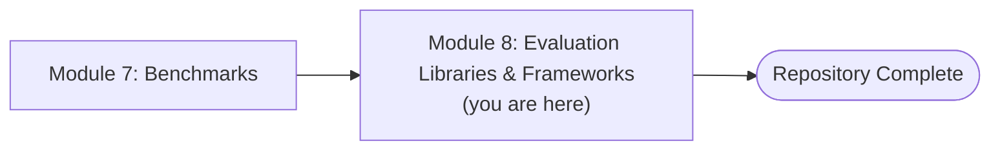
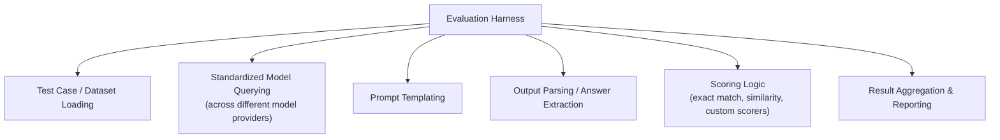
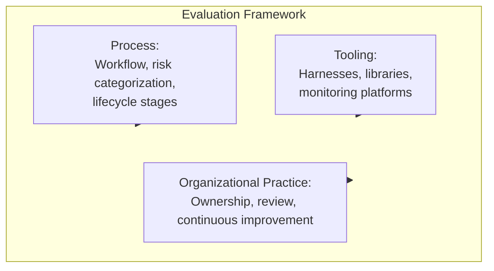
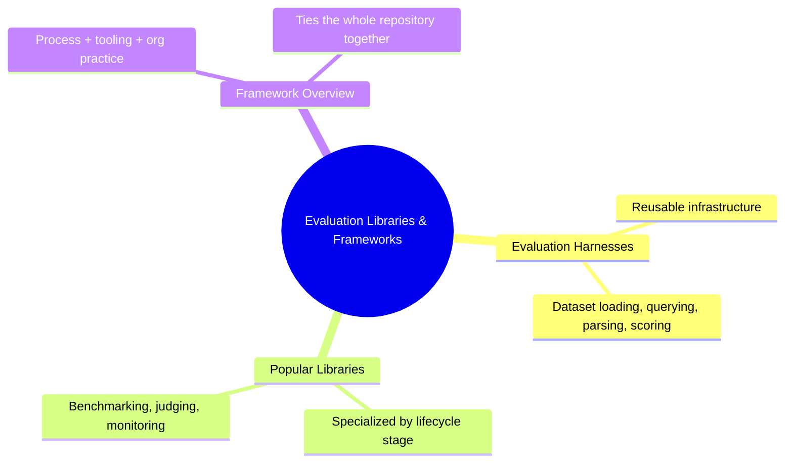
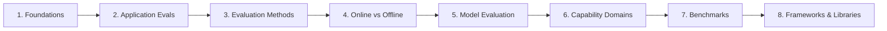

# Module 8 — Evaluation Libraries & Frameworks

> **Module Goal:** Survey the tooling landscape that ties everything in this repository together into practical, usable infrastructure. By the end of this module, you should understand evaluation harnesses as a category of tooling, know the general landscape of popular libraries and frameworks used in the industry, and understand how to think about choosing between them.

---

## 📍 Where This Fits

This is the final module in the repository. Every prior module has been building toward this point: now that you understand *why* evaluation matters (Module 1), *how* to evaluate applications (Module 2), *which methods* to use (Module 3), *when* in the lifecycle to evaluate (Module 4), *what* model evaluation means (Module 5), *which capabilities* to test (Module 6), and *which benchmarks* measure them (Module 7) — this module covers the actual tools that implement all of it.

> **Note:** This module provides a conceptual overview of the tooling landscape. Detailed, hands-on implementation walkthroughs are earmarked as a future addition to this repository (see the README's roadmap) — as noted in the introduction, this repository does not invent implementation details beyond what the source material supports.

---

## 1. Evaluation Harnesses

### Intuition

Module 7 introduced the evaluation harness conceptually — the infrastructure that standardizes how a benchmark is actually run against a model. This section revisits that concept from a tooling perspective: harnesses aren't just an abstract idea, they're real, reusable software that teams adopt rather than building from scratch every time.

### Definition

An **Evaluation Harness** (as a tooling category) is a reusable software system — often open-source — that provides standardized infrastructure for defining test cases, querying a model, parsing its outputs, applying scoring logic, and reporting results, so that individual teams and researchers don't need to rebuild this infrastructure independently for every evaluation effort.

### Why This Category of Tooling Exists

Building reliable evaluation infrastructure from scratch is a significant engineering effort — prompt formatting, output parsing, scoring logic, result aggregation, and reporting all need to be handled correctly and consistently. Shared harness tooling exists so that this effort is done once, well, and reused broadly — the same way testing frameworks exist in traditional software engineering so that every team doesn't reinvent test-running infrastructure from scratch.

### What a Harness Typically Provides

- **Test case / dataset loading** — standardized ways to load and iterate over benchmark or custom eval datasets
- **Standardized model querying** — the ability to run the same evaluation against different models or providers consistently
- **Prompt templating** — consistent formatting of how test cases are presented to the model
- **Output parsing** — extracting a gradable answer from a model's free-form response
- **Scoring logic** — implementations of common scoring methods (exact match, similarity, custom rubric-based scoring)
- **Result aggregation and reporting** — turning individual test-case results into an overall score and report

### Real-World Analogy

An evaluation harness is like a **standardized test administration company** used across many schools — rather than every individual school inventing its own exam logistics, proctoring rules, and grading procedures from scratch, they rely on a shared, trusted system that handles all of it consistently.

### Practical Example

Instead of writing custom code to load a benchmark dataset, format prompts, query a model, and parse its answers, a team uses an existing evaluation harness that already handles all of these steps — supplying only the specific benchmark or custom eval set they want to run and the model they want to test.

### Industry Use Case

Evaluation harnesses are widely used both for running standardized public benchmarks (Module 7) and for running custom, private application-level evaluations (Module 2) — the same underlying infrastructure often supports both use cases.

### Common Mistakes

- Building fully custom evaluation infrastructure when an existing, well-tested harness already covers the need.
- Assuming a harness's default scoring logic is appropriate for every task without verifying it matches the specific evaluation method needed (Module 3).
- Not considering how well a harness integrates with the specific models or providers a team actually needs to evaluate.

### Interview Questions

- What core functions does an evaluation harness typically provide?
- Why is it usually better to use an established evaluation harness rather than building custom evaluation infrastructure from scratch?
- What considerations would you weigh when choosing a harness for a specific evaluation need?

### Key Takeaways

- An evaluation harness is reusable infrastructure for running evaluations consistently — dataset loading, querying, parsing, scoring, and reporting.
- This tooling category exists to avoid every team reinventing the same infrastructure independently.
- Harnesses support both standardized public benchmark evaluation and custom application-level evaluation.

> **Implementation details — such as specific configuration, code examples, and step-by-step setup for particular harness tools — will be covered in a later module**, as noted in this repository's roadmap.

---

## 2. Popular Libraries

### Intuition

Beyond general-purpose harnesses, the ecosystem includes libraries focused on more specific pieces of the evaluation puzzle — some specialize in LLM-as-a-judge workflows, some in tracking and observability for production monitoring, some in specific benchmark suites.

### Definition

**Evaluation libraries** are software packages — typically open-source or offered as part of a platform — that implement specific evaluation functionality: running benchmarks, scoring outputs, tracking evaluation results over time, or supporting particular evaluation methods like LLM-as-a-judge.

### Categories of Libraries in the Ecosystem

| Category | What It Focuses On | Connects To |
|---|---|---|
| **Benchmark-running libraries** | Running models against standardized public benchmarks (Module 7) consistently | Model Evaluation (Module 5) |
| **LLM-as-a-judge libraries** | Structured tooling for using a model to score another model's outputs | Evaluation Methods (Module 3) |
| **Application/product eval libraries** | Tools focused on evaluating full LLM applications — prompts, retrieval, tool use | Application Evaluation (Module 2) |
| **Monitoring / observability platforms** | Tracking live production performance, logging, and continuous evaluation | Online Evaluation & Continuous Monitoring (Module 4) |
| **Dataset / test-case management tools** | Organizing, versioning, and growing evaluation datasets over time | Self-Improving Loop (Module 4) |

### Why This Landscape Exists

Different parts of the evaluation lifecycle have different needs, and no single tool does everything well. Just as software engineering has separate tools for testing, monitoring, and logging rather than one monolithic tool, LLM evaluation tooling has similarly specialized, focusing on doing one part of the lifecycle well rather than everything.

### Real-World Analogy

This mirrors the broader software engineering toolchain — a team doesn't use one single tool for writing code, testing it, deploying it, and monitoring it in production. They use a *chain* of specialized tools, each excelling at its specific stage. Evaluation tooling has developed the same way.

### Practical Example

A team might use one library to run standardized benchmarks when evaluating candidate models (Module 5), a separate LLM-as-a-judge library for scoring their application's open-ended chat responses (Modules 2 and 3), and a separate monitoring platform to track live production quality signals (Module 4) — three different tools, each mapped to a different stage of the overall evaluation lifecycle covered in this repository.

### Industry Use Case

Mature AI engineering teams typically assemble a toolchain from several of these specialized libraries and platforms rather than relying on a single all-purpose tool, mirroring how this repository itself is structured around distinct stages: methods, lifecycle, model capability, and benchmarking.

### Common Mistakes

- Trying to force a single tool to handle every stage of the evaluation lifecycle when it wasn't designed for that.
- Choosing a library based on popularity alone, without checking whether it actually supports the specific evaluation method (Module 3) or lifecycle stage (Module 4) needed.
- Underestimating the importance of monitoring/observability tooling relative to pre-launch evaluation tooling.

### Interview Questions

- Why does the evaluation tooling ecosystem consist of many specialized libraries rather than one comprehensive tool?
- How would you choose which category of evaluation library to adopt for a given need?
- What's the relationship between an LLM-as-a-judge library and the concepts introduced in Module 3?

### Key Takeaways

- The evaluation library ecosystem is specialized, with different tools focused on benchmarking, judging, application evaluation, and monitoring.
- This mirrors the broader pattern in software engineering of chaining specialized tools rather than relying on one monolithic solution.
- Choosing the right tool requires mapping it to the specific stage of the evaluation lifecycle it's meant to support.

> **Implementation details — specific library names, setup instructions, and code-level usage examples — will be covered in a later module.**

---

## 3. Framework Overview

### Intuition

Zooming out from individual tools, it's worth understanding evaluation "frameworks" as a broader concept: not just a single library, but an overall approach and structure for organizing evaluation work across an entire team or organization.

### Definition

An **Evaluation Framework**, in the broader sense, is the combination of tooling, process, and organizational practice that ties together everything covered in this repository — methods (Module 3), lifecycle (Module 4), capability domains (Module 6), and benchmarking (Module 7) — into a coherent, repeatable evaluation practice for a team or organization.

### How the Pieces Fit Together

A framework, in this holistic sense, isn't just "which library did we install" — it's the full combination of *how* a team defines quality (Module 2), *which methods* it uses to measure it (Module 3), *when* in the product lifecycle it measures (Module 4), *which capabilities* it cares about (Module 6), *which standardized yardsticks* it references (Module 7), and *which tools* it uses to actually execute all of this (this module).

### Why It Matters

Even excellent individual tools fail to produce good outcomes if they're not embedded in a coherent overall practice. A team can have access to the best evaluation harness available and still ship unreliable AI products if they haven't defined what "good" means (Module 2), haven't chosen appropriate methods for their tasks (Module 3), and haven't built continuous monitoring into their lifecycle (Module 4). The framework is what ties the tools to genuine outcomes.

### Real-World Analogy

This is the difference between owning excellent kitchen equipment and actually running a well-managed kitchen. A restaurant can have the best knives, ovens, and thermometers available (the tools) and still produce inconsistent food if it lacks a coherent process — recipes, quality standards, staff training, and continuous feedback (the framework). Tools enable good outcomes; they don't guarantee them without the surrounding practice.

### Practical Example

A team building an LLM-powered application puts together their own evaluation framework by:

- Defining risk categories and failure points specific to their product (Module 2)
- Selecting evaluation methods appropriate to each part of their pipeline (Module 3)
- Establishing an offline/online evaluation pipeline with continuous monitoring (Module 4)
- Identifying which capability domains matter most for their use case (Module 6)
- Using relevant public benchmarks to inform model selection (Module 7)
- Adopting specific harness and library tooling to execute all of the above consistently (this module)

None of these steps alone constitutes "an evaluation framework" — together, they do.

### Industry Use Case

Mature AI organizations increasingly treat evaluation as its own discipline with dedicated ownership — sometimes formalized as an "AI quality" or "evals" function — responsible for maintaining this end-to-end framework across the organization, rather than leaving it to be assembled ad hoc by individual product teams.

### Common Mistakes

- Equating "having good tools" with "having a good evaluation framework," and neglecting the process and organizational dimensions.
- Building process and tooling in isolation from each other, rather than as a coherent, connected system.
- Treating framework-building as a one-time setup rather than something that evolves — echoing the self-improving loop concept from Module 4.

### Interview Questions

- What's the difference between an evaluation tool and an evaluation framework, in the broader sense?
- Why can a team with excellent evaluation tooling still ship unreliable AI products?
- How would you go about building an evaluation framework for a team starting from scratch?

### Key Takeaways

- A framework, in the fullest sense, combines process, tooling, and organizational practice — not just a single library or platform.
- Excellent tools alone don't guarantee good outcomes without a coherent surrounding practice.
- Building a genuine evaluation framework means synthesizing everything covered across this entire repository into one coherent, ongoing practice.

> **Implementation details for specific frameworks — setup, configuration, and organizational rollout guidance — will be covered in a later module.**

---

## 📌 Module 8 Summary

---

## 🎓 Repository Complete

Congratulations — you've now completed all eight modules of this repository, covering the full arc of LLM evaluation:

You've built a foundation spanning:

- **Why** evaluation is a distinct discipline from traditional software testing
- **How** to evaluate real applications — workflows, failure points, risk, and evaluation paradigms
- **Which methods** to use for scoring, and how to combine them
- **When** in a product's lifecycle evaluation happens, from offline testing to continuous production monitoring
- **What** model evaluation means and why every AI engineer needs to understand it
- **Which capabilities** frontier labs evaluate, and why they're measured separately
- **Which benchmarks** ground these capabilities in concrete, standardized measurement — and their real limitations
- **What tooling** ties all of this together into practice

*This concludes the LLM Evals repository. Thank you for working through it module by module.*
