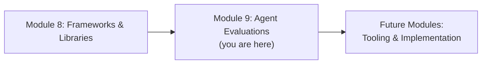
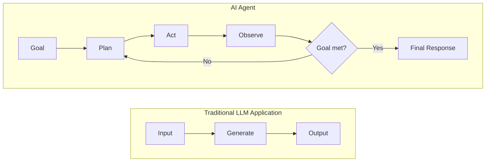
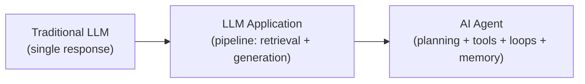
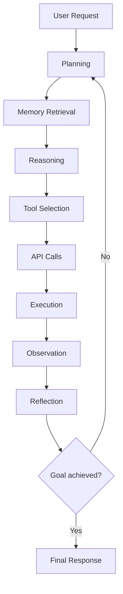
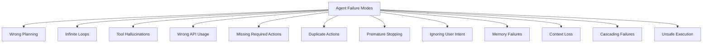
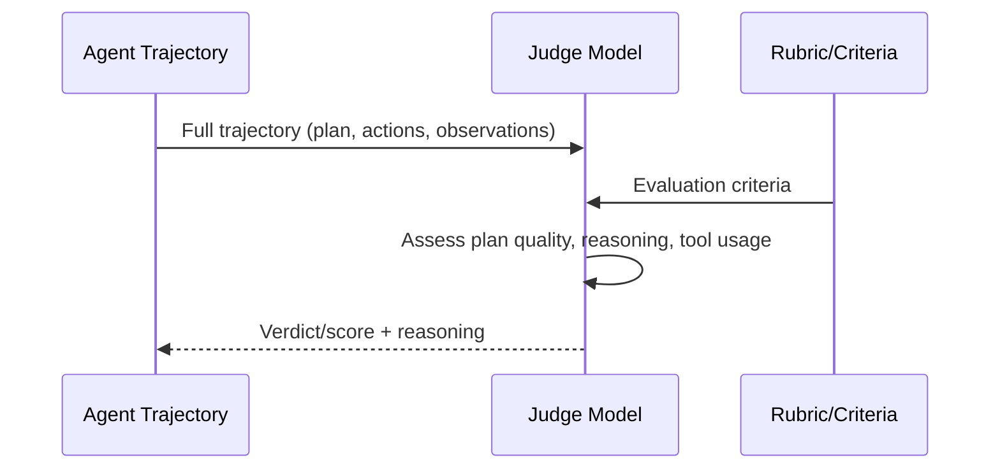
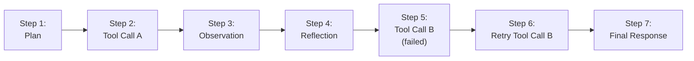
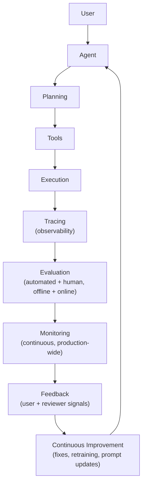
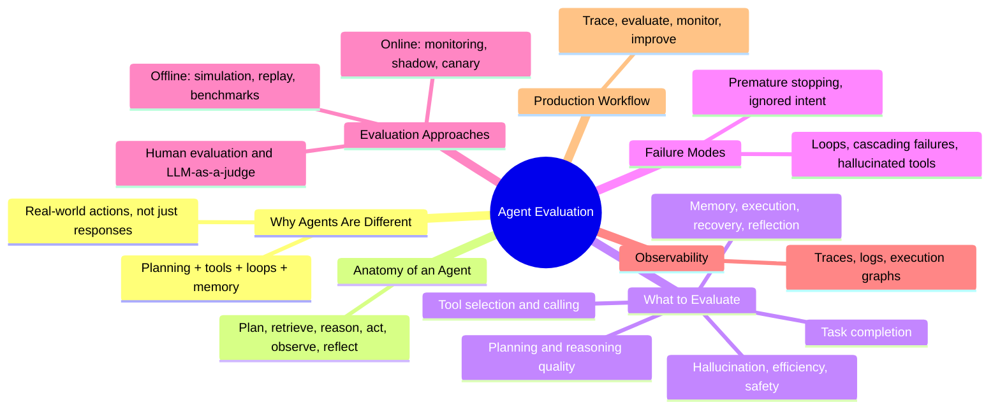

# Module 9 — Agent Evaluations

> **Module Goal:** Extend everything you've learned about evaluating LLM applications into the world of autonomous AI agents — systems that plan, reason, remember, call tools, execute multi-step tasks, and adapt based on what happens along the way. By the end of this module, you should be able to design an evaluation strategy for an agentic system, know what to measure at each stage of an agent's execution, recognize common agent failure modes, and speak fluently about how production AI companies evaluate and monitor agents.

---

## 📍 Where This Fits

Modules 1–8 built your foundation on evaluating models and single-turn (or single-response) LLM applications. This module extends that foundation into a fundamentally more complex system: the **AI agent**.

> **Note:** This module assumes you've completed Modules 1–8 and builds directly on concepts like failure points (Module 2), evaluation methods (Module 3), the online/offline lifecycle (Module 4), and LLM-as-a-judge (Module 3). Where relevant, we'll reference those modules rather than re-explaining them.

---

## 1. Introduction to Agent Evaluations

### What Is an AI Agent?

### Intuition

Everything up to this module has largely dealt with a model — or an application wrapped around a model — producing a single response to a single input. An **agent** is different: it's a system that can take a goal, break it into steps, decide what actions to take, actually take those actions (often via tools or APIs), observe what happens, and adjust its plan — repeating this cycle until the goal is achieved or it gives up.

Think of the difference between asking someone a question and hiring someone to handle a project. Answering a question is a single, bounded act. Handling a project involves planning, using resources, checking progress, correcting course when something goes wrong, and knowing when the job is actually done. An agent is built to do the latter.

### Definition

An **AI Agent** is an LLM-powered system capable of autonomous, multi-step behavior — planning a sequence of actions toward a goal, selecting and invoking tools or APIs, incorporating the results of those actions into its ongoing reasoning, and continuing or adjusting its behavior until the task is complete.

### How Agents Differ From Traditional LLM Applications

A traditional LLM application (Module 2) typically follows a fairly linear pipeline: input → (maybe retrieval) → generation → output. An agent introduces **loops, autonomy, and state** — it can call a tool, see the result, decide to call another tool, retrieve something from memory, revise its plan, and keep going, often for many steps, without a human in the loop at every turn.

### Why Agent Evaluation Has Become Important

As LLM systems have moved from answering questions to *doing things* — booking travel, writing and running code, browsing the web, managing multi-step workflows — the stakes of getting evaluation wrong have grown substantially. A wrong single-turn answer is a bad response. A wrong *action* taken by an agent — an unauthorized purchase, a destructive code execution, a leaked piece of sensitive data — is a real-world event with real consequences.

### Why Frontier AI Companies Invest Heavily in Agent Evaluation

Frontier labs and production AI companies invest heavily here because agents compound risk and complexity at every step. A single-turn application has one chance to fail. An agent executing a 15-step task has fifteen chances — and a failure at any step can cascade into a chain of subsequent errors (a failure mode we'll cover in detail in Section 5). Rigorous agent evaluation is what makes it possible to trust these systems enough to deploy them with real autonomy and real permissions.

### Interview Questions

- What is the fundamental difference between an LLM application and an AI agent?
- Why does autonomy increase the importance of evaluation, rather than decrease the need for it?
- Why might a company be more cautious deploying an agent than a single-turn chatbot, even if both use the same underlying model?

### Key Takeaways

- An AI agent plans, acts, observes, and adapts across multiple steps toward a goal — not just a single generation.
- Agents introduce loops, autonomy, and persistent state that traditional LLM applications don't have.
- The real-world consequences of agent actions (versus just responses) are why agent evaluation is treated as a critical, high-investment discipline.

---

## 2. Why Traditional LLM Evaluation Is Not Enough

### Intuition

Imagine grading a student only on their final exam score, with no visibility into how they solved each problem. If they got the right answer by lucky guessing, you'd never know. If they got the wrong answer despite excellent reasoning up until one small slip, you'd never know that either. Evaluating an agent only by its *final answer* has exactly this blind spot — and the stakes are higher, because an agent's "work" involves real actions, not just written reasoning.

### The Progression: Traditional LLM → LLM Application → AI Agent

| Dimension | Traditional LLM | LLM Application | AI Agent |
|---|---|---|---|
| **Interaction shape** | Single input → single output | Input → pipeline → output | Goal → multi-step loop → outcome |
| **State** | None (stateless per call) | Sometimes (conversation history) | Persistent across the entire task (memory, plan, intermediate results) |
| **External actions** | None | Sometimes (a single retrieval or tool call) | Frequently — multiple tool/API calls, code execution, browsing |
| **Failure surface** | The response itself | Response + retrieval + single tool step (Module 2) | Every planning decision, every tool call, every intermediate step |
| **Evaluation focus** | Output quality | Output quality + pipeline failure points | Full trajectory: plan, actions, observations, adaptation, final outcome |
| **Covered in this repo** | Modules 1, 5–7 | Module 2 | Module 9 (this module) |

### Why Checking Only the Final Answer Hides Many Failures

Consider an agent tasked with booking a flight that ultimately succeeds — the user gets a confirmed booking. A final-answer-only evaluation would mark this a success. But what if, along the way, the agent:

- Called the wrong airline's API twice before finding the right one (inefficiency)
- Retrieved and briefly acted on outdated pricing information before self-correcting (a near-miss on cost accuracy)
- Retried a failed payment step three times without checking why it failed first (a fragile recovery pattern that could easily have gone wrong)

The task "succeeded," but the *process* was unreliable in ways that will eventually cause a real failure under slightly different conditions. This is exactly why agent evaluation must look at the full **trajectory** — the entire sequence of steps — not just the final outcome.

> **Note:** This idea — evaluating the process, not just the outcome — is the single most important shift this module introduces relative to Modules 1–8.

### Interview Questions

- Why is it insufficient to evaluate an agent using only its final output?
- Give an example of an agent task that "succeeds" on the surface but reveals serious problems when you look at the full trajectory.
- How does the failure surface of an agent differ from that of a single-turn LLM application?

### Key Takeaways

- Agents represent a further evolution beyond traditional LLMs and LLM applications, introducing state, autonomy, and multi-step external action.
- Evaluating only the final answer misses inefficiencies, near-misses, and fragile behavior that will eventually cause real failures.
- Agent evaluation must assess the full trajectory — every planning decision, action, and adaptation — not just whether the task technically got done.

---

## 3. Anatomy of an AI Agent

### Intuition

To know what to evaluate, you first need to understand the stages an agent actually moves through when handling a task. Just as Module 2 broke an LLM application into failure points along its pipeline, this section breaks an agent down into its full operating lifecycle.

### The Agent Lifecycle

### Stage-by-Stage Explanation

**User Request** — The starting point: a goal or task expressed by the user, often underspecified or ambiguous, requiring the agent to interpret intent before acting.

**Planning** — The agent breaks the overall goal down into a sequence of smaller, actionable steps. This might be an explicit, written-out plan, or an implicit step-by-step decision process. Planning quality (covered in Section 4) is one of the most important things to evaluate, because a flawed plan dooms everything downstream.

**Memory Retrieval** — The agent pulls in relevant context: prior conversation history, previously stored facts, results from earlier steps in the current task, or longer-term memory from past interactions. This is distinct from the model's context window alone — memory systems often involve active retrieval from a separate store.

**Reasoning** — The agent reasons about what to do next, given the current plan, retrieved memory, and the state of the task so far. This is where the model decides *how* to approach the immediate next step.

**Tool Selection** — The agent decides *which* tool, function, or API is appropriate for the current step — for example, choosing between a "search flights" tool and a "check calendar" tool.

**API Calls** — The agent formats and issues the actual call to the selected tool — including constructing correct parameters/arguments.

**Execution** — The tool or API actually runs, performing the real-world action (a search, a code execution, a database query, a purchase).

**Observation** — The agent receives and processes the result of that execution — success, failure, returned data, an error message.

**Reflection** — The agent assesses what just happened: did the action succeed? Did it move the task forward? Does the plan need to change based on this new information?

**Next Action** — Based on reflection, the agent either proceeds to the next step in its plan, revises the plan, retries a failed action, or determines the goal has been achieved.

**Final Response** — Once the agent determines the goal is met (or that it cannot proceed further), it produces a final response summarizing the outcome for the user.

> **Warning:** Not every agent implementation includes every stage explicitly (some fold memory retrieval into reasoning, for instance), and stages can repeat many times in a loop before reaching a final response. The value of this breakdown is diagnostic — it gives you a vocabulary for pinpointing exactly *where* in this cycle a failure occurred, the same way Module 2's failure points did for simpler pipelines.

### Interview Questions

- Walk through the full lifecycle of an AI agent handling a multi-step task.
- Why is it useful to separate "tool selection" from "API calls" as distinct evaluation points?
- What role does the reflection stage play, and why does its absence create risk?

### Key Takeaways

- An agent's lifecycle spans planning, memory retrieval, reasoning, tool selection, execution, observation, reflection, and iteration toward a final response.
- Each stage is a distinct point where failure can be introduced — mirroring, but expanding on, the failure-point thinking from Module 2.
- This lifecycle gives evaluators a shared vocabulary for precisely diagnosing where and why an agent went wrong.

---

## 4. What Should Be Evaluated?

This section works through each major evaluable dimension of agent behavior, one at a time.

### Task Completion

**Did the agent achieve the goal?**

This is the most fundamental — but, as Section 2 established, least sufficient on its own — measure of agent quality. It asks a binary or graded question: by the end of the run, was the user's actual goal accomplished?

> **Tip:** Task completion should always be evaluated *alongside* the other dimensions below — it tells you *whether* something worked, not *how reliably* or *how safely* it worked.

### Planning Quality

**Did the agent create an efficient plan?**

This assesses whether the initial (and any revised) plan was logical, complete, and efficient — did it include unnecessary steps, miss necessary ones, or sequence steps in a suboptimal order? A plan can be *achievable* but still poor quality if it wastes steps or takes needless risks.

### Reasoning Quality

**Was the reasoning logical?**

Distinct from planning (the *what*), this evaluates the *how* — was each individual reasoning step, at each stage of the loop, logically sound? Did the agent correctly interpret observations, correctly infer next steps, and avoid faulty logic even when it happened to still reach the right final outcome?

### Tool Selection

**Did it choose the correct tool?**

This measures whether, at each decision point, the agent picked the appropriate tool for the task at hand — not a plausible-sounding but wrong one, and not a needlessly roundabout one when a more direct tool existed.

### Tool Calling

**Did it use correct parameters? Were API calls valid?**

Even correct tool selection can fail here — an agent might pick the right tool but pass malformed, incomplete, or incorrect arguments. This dimension evaluates the mechanical correctness of the actual call: valid formatting, correct parameter values, and compliance with the tool's expected schema.

### Memory Usage

**Did it retrieve relevant memories? Did it ignore irrelevant context?**

This evaluates both sides of memory quality: **recall** (did the agent pull in the information it actually needed?) and **precision** (did it avoid being distracted or misled by irrelevant retrieved context?). Both failure directions — missing important context and being derailed by noise — are common and worth evaluating separately.

### Multi-Step Execution

**Did it successfully finish all steps?**

This looks at the full sequence of planned actions and checks whether each one was actually carried out, in the intended order, without silently skipping or abandoning steps partway through.

### Error Recovery

**How did it recover after failures?**

Real-world tool calls and APIs fail — rate limits, invalid inputs, transient errors. This dimension evaluates whether the agent noticed a failure, diagnosed it correctly, and took a sensible corrective action, rather than blindly retrying, giving up prematurely, or (worse) proceeding as if the failed action had succeeded.

### Reflection

**Did it recognize mistakes? Did it improve during execution?**

This evaluates whether the agent's reflection stage (Section 3) genuinely functioned — catching its own errors mid-task and adjusting course — versus mechanically moving forward regardless of what its own observations revealed.

### Hallucination Detection

**Did it invent tools? Did it invent APIs? Did it fabricate observations?**

Agent-specific hallucination is a distinct and serious concern: an agent might reference a tool that doesn't exist, invent a plausible-sounding but fictional API response, or claim to have completed an action it never actually performed. This is often more dangerous than text hallucination (Module 6, Knowledge & Reasoning) because it can drive further real-world actions based on fabricated information.

### Efficiency

**Number of tool calls, latency, token usage, cost.**

Even a fully successful, well-reasoned agent run can be evaluated on efficiency: did it take an excessive number of steps, consume excessive tokens, run unacceptably slowly, or cost more than a reasonably efficient approach would have?

### Safety

**Unsafe tool execution, prompt injection, data leakage, permission boundaries, sensitive actions.**

Because agents take real actions, safety evaluation (building on Module 6, Safety & Alignment) becomes especially critical: did the agent stay within its authorized permissions? Did it resist prompt injection attempts hidden in tool outputs or retrieved content? Did it avoid leaking sensitive data across contexts? Did it treat high-consequence actions (payments, deletions, external communications) with appropriate caution?

### Summary Table

| Dimension | Core Question |
|---|---|
| Task Completion | Was the goal achieved? |
| Planning Quality | Was the plan efficient and complete? |
| Reasoning Quality | Was each reasoning step logically sound? |
| Tool Selection | Was the right tool chosen at each step? |
| Tool Calling | Were parameters and API calls correctly formed? |
| Memory Usage | Was relevant context retrieved, and irrelevant context ignored? |
| Multi-step Execution | Were all planned steps actually completed? |
| Error Recovery | Did the agent handle failures sensibly? |
| Reflection | Did the agent catch and correct its own mistakes? |
| Hallucination Detection | Did the agent fabricate tools, APIs, or observations? |
| Efficiency | Was the task completed with reasonable cost, time, and steps? |
| Safety | Did the agent stay within safe, authorized boundaries? |

### Interview Questions

- Why is task completion alone an insufficient measure of agent quality?
- What's the difference between a tool selection failure and a tool calling failure?
- How would you specifically test whether an agent hallucinates tool outputs?
- Why is memory evaluation two-sided — both recall and precision?

### Key Takeaways

- A complete agent evaluation covers twelve distinct dimensions, from task completion down to safety.
- Many of these dimensions can succeed or fail independently of one another — a task can complete despite poor planning, or fail despite excellent reasoning.
- Comprehensive agent evaluation requires assessing the full trajectory across all of these dimensions, not just the final outcome.

---

## 5. Agent Failure Modes

### Intuition

Just as Module 2 catalogued failure points for LLM applications, agents have their own distinctive catalogue of failure modes — many of which simply don't exist in single-turn systems, because they require multiple steps, state, and real-world action to manifest.

### Common Agent Failure Modes

| Failure Mode | What It Looks Like | Realistic Example |
|---|---|---|
| **Wrong planning** | The initial plan is logically flawed or misses necessary steps | An agent booking a trip forgets to check calendar conflicts before booking flights |
| **Infinite loops** | The agent repeats the same (failing) action indefinitely without escalating or stopping | A research agent keeps re-querying the same search with no new results, never concluding |
| **Tool hallucinations** | The agent references a tool or capability that doesn't actually exist | An agent tries to call a "cancel_subscription" tool that was never provided to it |
| **Wrong API usage** | The agent calls a real tool but with invalid or nonsensical parameters | An agent passes a string where a date object is required, causing a silent failure |
| **Missing required actions** | The agent skips a step necessary for correctness or safety | A coding agent commits code without running the test suite it had access to |
| **Duplicate actions** | The agent redundantly repeats an already-completed action | An agent sends the same confirmation email to a customer three times |
| **Premature stopping** | The agent concludes the task is done before it actually is | A booking agent reports success after only reserving a flight, without completing payment |
| **Ignoring user intent** | The agent technically completes *a* task, but not the one the user actually meant | The user asks to "reschedule" a meeting; the agent cancels it instead |
| **Memory failures** | The agent fails to retrieve or correctly use relevant prior context | A support agent re-asks a customer for information they already provided earlier in the conversation |
| **Context loss** | Important information from earlier in a long task is dropped or overwritten | A multi-step research agent forgets an earlier constraint the user specified |
| **Cascading failures** | An early error propagates and compounds through later steps | A wrong initial data retrieval leads to a wrong calculation, which leads to a wrong final report |
| **Unsafe execution** | The agent takes an action outside its intended safety or permission boundaries | An agent with file-deletion access removes files beyond the scope of the requested cleanup task |

### Why Cascading Failures Deserve Special Attention

> **Warning:** Cascading failures are uniquely dangerous in agent systems because a single, early, relatively minor error can silently propagate through many downstream steps, growing more consequential at each stage, until it surfaces as a serious final-outcome failure that looks disconnected from its true root cause. This is precisely why trajectory-level evaluation (Section 2) — not just final-answer checking — is essential for agents: it lets you catch the small early error before it cascades.

### Interview Questions

- What is a cascading failure in an agentic system, and why is it particularly dangerous?
- How would you detect an infinite loop in an agent's execution before it wastes excessive resources?
- What's the difference between "premature stopping" and genuine task completion, and how would you evaluate for it?
- Why might an agent ignore user intent even while technically completing a task?

### Key Takeaways

- Agents introduce a distinctive set of failure modes that don't exist in single-turn systems — loops, cascading errors, tool hallucination, and more.
- Many of these failures are only visible through full trajectory analysis, not final-answer checking.
- Cascading failures are especially dangerous because small early errors can compound into serious final-outcome problems.

---

## 6. Agent Evaluation Metrics

### Task Success Rate

**Definition:** The percentage of tasks an agent completes successfully out of all attempted tasks.

**Formula:** `Task Success Rate = (Successful Tasks / Total Tasks) × 100`

**Industry usage:** The most commonly reported headline metric for agent performance, similar in spirit to accuracy in traditional model evaluation.

**Advantages:** Simple, intuitive, directly tied to user value.

**Limitations:** Says nothing about *how* the task was completed — hides inefficiency, near-misses, and unsafe behavior (Section 2).

---

### Step Success Rate

**Definition:** The percentage of individual steps within a task's trajectory that were completed correctly.

**Formula:** `Step Success Rate = (Correct Steps / Total Steps) × 100`

**Industry usage:** Used to diagnose *where* in a trajectory failures cluster, rather than just whether the overall task succeeded.

**Advantages:** Provides trajectory-level visibility (addressing the exact gap from Section 2).

**Limitations:** Requires step-level annotation or scoring, which is more expensive to produce than a single final-outcome label.

---

### Tool Success Rate

**Definition:** The percentage of tool/API calls that executed successfully (without errors) out of all tool calls made.

**Formula:** `Tool Success Rate = (Successful Tool Calls / Total Tool Calls) × 100`

**Industry usage:** A key operational health metric, often tracked per-tool to identify unreliable integrations.

**Advantages:** Directly actionable — low scores point straight at a specific tool integration to investigate.

**Limitations:** A successful tool call (no error) doesn't guarantee it was the *right* call to make (see Tool Precision below).

---

### Plan Accuracy

**Definition:** A measure of how closely an agent's generated plan matches an efficient, correct plan for the given task (often judged via human or LLM-as-a-judge review, per Module 3).

**Industry usage:** Used especially during development and offline evaluation (Section 7) to assess planning quality independent of execution outcomes.

**Advantages:** Captures planning quality even when execution details vary.

**Limitations:** Often subjective — multiple valid plans can exist for the same goal, making strict comparison difficult (echoing the reference-based vs. reference-free discussion in Module 2).

---

### Tool Precision

**Definition:** Of all the tools the agent chose to call, what percentage were actually appropriate/necessary for the task?

**Formula:** `Tool Precision = (Appropriate Tool Calls / Total Tool Calls Made)`

**Industry usage:** Flags agents that over-call tools unnecessarily, adding cost and latency without benefit.

**Advantages:** Directly measures unnecessary or wasteful tool use.

**Limitations:** Requires a ground truth or expert judgment of which calls were truly "necessary."

---

### Tool Recall

**Definition:** Of all the tools that *should* have been used to complete the task correctly, what percentage did the agent actually use?

**Formula:** `Tool Recall = (Necessary Tools Used / Total Necessary Tools)`

**Industry usage:** Flags agents that fail to use available capabilities they needed (e.g., not checking a calendar before booking a meeting).

**Advantages:** Captures under-use of available tools, distinct from precision's focus on over-use.

**Limitations:** Also requires ground truth on the "necessary" tool set, which can be ambiguous for open-ended tasks.

---

### Execution Accuracy

**Definition:** The correctness of the actual outcomes produced by the agent's actions (e.g., was the data retrieved actually correct, was the code executed correctly).

**Industry usage:** Used to validate that successful-looking tool calls actually produced correct real-world results, not just error-free ones.

**Advantages:** Catches "silent" correctness failures that a simple tool success rate would miss.

**Limitations:** Often requires reference-based comparison (Module 2) against known-correct outcomes, which isn't always available.

---

### Completion Time

**Definition:** The total wall-clock time taken for the agent to complete a task.

**Industry usage:** A core efficiency and user-experience metric, particularly important for latency-sensitive applications.

**Advantages:** Directly tied to user experience and operational cost.

**Limitations:** Faster isn't always better if it comes at the cost of task quality or safety — must be considered alongside other metrics.

---

### Cost per Task

**Definition:** The total monetary cost (model inference, tool/API usage fees) incurred to complete a single task.

**Industry usage:** Critical for evaluating whether an agent is economically viable to deploy at scale.

**Advantages:** Directly ties agent performance to business viability.

**Limitations:** Can incentivize under-investing in steps (like verification or reflection) that improve reliability but add cost.

---

### Token Usage

**Definition:** The total number of tokens consumed (input and output) across a task's full trajectory.

**Industry usage:** A proxy for both cost and efficiency, tracked especially closely for long-running or high-volume agents.

**Advantages:** Easy to measure precisely and consistently.

**Limitations:** High token usage isn't inherently bad if it reflects genuinely necessary reasoning — needs contextual interpretation.

---

### Human Satisfaction

**Definition:** A measure of how satisfied real users (or expert reviewers) are with the agent's overall performance, typically gathered via ratings or structured feedback.

**Industry usage:** A critical online evaluation signal (Section 8) that captures dimensions automated metrics might miss entirely.

**Advantages:** Directly reflects real user experience, the ultimate target of any product.

**Limitations:** Expensive to collect at scale, and subject to the same rater variability discussed for human evaluation in Module 3.

---

### Error Rate

**Definition:** The percentage of steps, tool calls, or tasks that resulted in an error or failure.

**Industry usage:** A general-purpose reliability metric tracked at multiple levels (per-step, per-tool, per-task).

**Advantages:** Simple, broadly applicable, easy to monitor continuously.

**Limitations:** Doesn't distinguish between minor, self-corrected errors and severe, task-derailing ones without further breakdown.

---

### Recovery Rate

**Definition:** Of all the errors an agent encountered, what percentage did it successfully recover from and still complete the task?

**Formula:** `Recovery Rate = (Errors Successfully Recovered From / Total Errors Encountered)`

**Industry usage:** A key resilience metric — directly measures the error recovery capability discussed in Section 4.

**Advantages:** Distinguishes robust agents (that fail gracefully) from fragile ones (that fail catastrophically at the first error).

**Limitations:** Requires reliable error detection and outcome tracking to measure accurately.

---

### Metrics Summary Table

| Metric | Measures | Best Used For |
|---|---|---|
| Task Success Rate | Overall goal achievement | Headline performance reporting |
| Step Success Rate | Per-step correctness | Diagnosing where failures occur |
| Tool Success Rate | Tool/API call reliability | Identifying unreliable integrations |
| Plan Accuracy | Quality of the generated plan | Offline development evaluation |
| Tool Precision | Avoidance of unnecessary tool use | Efficiency and cost control |
| Tool Recall | Use of all necessary tools | Catching under-use of capabilities |
| Execution Accuracy | Correctness of action outcomes | Catching silent correctness failures |
| Completion Time | Task latency | User experience, operational cost |
| Cost per Task | Economic viability | Business/scaling decisions |
| Token Usage | Resource efficiency | Cost and efficiency proxy |
| Human Satisfaction | Real user experience | Online evaluation, product quality |
| Error Rate | General reliability | Continuous monitoring |
| Recovery Rate | Resilience to failure | Robustness assessment |

### Interview Questions

- What's the difference between tool precision and tool recall in the context of agent evaluation?
- Why might a high task success rate coexist with a low step success rate?
- How would you decide which of these metrics matter most for a cost-sensitive production agent?

### Key Takeaways

- Agent evaluation relies on a broader, more granular set of metrics than single-turn LLM evaluation.
- These metrics span outcome (task success), process (step/tool metrics), efficiency (time, cost, tokens), and resilience (error/recovery rates).
- No single metric tells the whole story — a mature evaluation strategy tracks several of these together.

---

## 7. Offline Agent Evaluation

### Intuition

Just as Module 4 introduced offline evaluation for LLM applications — testing against a fixed, controlled dataset before deployment — agents need their own offline evaluation approach, adapted for the fact that agents *act*, not just *respond*.

### Key Components

**Test datasets** — Curated collections of tasks with known, verifiable success criteria (e.g., "book a flight matching these constraints"), used to run the agent through repeatable, comparable scenarios.

**Simulation environments** — Controlled, sandboxed environments (simulated APIs, mock file systems, test databases) that let an agent take real actions without any real-world consequence, enabling safe, repeatable testing of actions that would be risky or costly to test against live systems.

**Replay testing** — Re-running an agent against previously recorded trajectories or scenarios (including past failures) to check whether a change fixed a known issue or introduced a regression — directly connecting to the self-improving loop concept from Module 4.

**Benchmark tasks** — Standardized, often publicly shared agent tasks (analogous to the model benchmarks in Module 7) used to compare agent performance across different configurations or versions in a consistent way.

**Synthetic users** — Simulated user personas (sometimes themselves LLM-driven) that interact with the agent to generate realistic, varied test scenarios at a scale that's difficult to achieve with only human-authored test cases.

### Advantages

- Safe: no real-world consequences from testing risky or destructive actions
- Repeatable and controlled, enabling clean before/after comparisons
- Can run at scale without waiting for real user traffic

### Disadvantages

- Simulated environments may not perfectly capture the messiness of real-world tools and data
- Test datasets can become stale or fail to reflect emerging real-world usage patterns (the same risk flagged for offline evaluation generally in Module 4)
- Synthetic users may not fully capture genuine human unpredictability

### Use Cases

- Pre-release regression testing before deploying a new agent version
- Validating that a bug fix actually resolved a known failure mode (via replay testing)
- Comparing two candidate agent architectures or prompt strategies head-to-head under identical conditions

### Interview Questions

- Why are simulation environments especially important for agent evaluation, compared to simpler LLM applications?
- What is replay testing, and how does it connect to the self-improving loop concept from Module 4?
- What are the risks of relying entirely on offline evaluation for an agent before deployment?

### Key Takeaways

- Offline agent evaluation relies on test datasets, simulation environments, replay testing, benchmark tasks, and synthetic users.
- Simulation environments are particularly important because agents take real actions that can be costly or risky to test live.
- Like all offline evaluation (Module 4), it's necessary but not sufficient — it must be paired with online evaluation.

---

## 8. Online Agent Evaluation

### Intuition

No simulation perfectly captures the real world. Online agent evaluation — watching how an agent actually performs against real users and real systems — catches what offline testing structurally cannot, echoing the online evaluation concept from Module 4, now applied to multi-step, action-taking systems.

### Key Components

**Production monitoring** — Continuously tracking the metrics from Section 6 (task success, error rate, cost, latency) against live traffic.

**User feedback** — Direct signals from real users (ratings, complaints, corrections) about whether the agent actually helped them.

**Shadow deployments** — Running a new agent version alongside the current production version on live traffic, without its actions actually taking effect, to compare behavior safely before a real rollout.

**A/B testing** — Splitting live traffic between two agent versions and comparing outcome metrics, directly extending the A/B testing concept introduced in Module 4.

**Canary releases** — Rolling out a new agent version to a small percentage of real traffic first, closely monitoring for problems before expanding further — the agent-specific application of staged deployment from Module 4's evaluation pipeline.

**Continuous monitoring** — Ongoing tracking of agent performance indefinitely after release, watching for the same data drift and model drift concerns discussed in Module 4, now compounded by drift in the external tools and APIs an agent depends on.

### Advantages

- Captures genuine real-world behavior and edge cases no offline test anticipated
- Reveals how real users actually interact with and rely on the agent
- Detects degradation caused by changes in external systems the agent depends on (e.g., a third-party API changing its behavior)

### Disadvantages

- Real mistakes can have real consequences before they're caught (mitigated but not eliminated by shadow deployments and canary releases)
- Slower to gather statistically meaningful signal compared to offline testing at scale
- Harder to isolate root cause when many things are changing in production simultaneously

### Industry Examples

Production AI companies operating agents at scale commonly combine shadow deployments (to validate a new version safely) with canary releases (to limit exposure during initial rollout) and continuous dashboards tracking task success rate, error rate, and cost per task in real time — directly paralleling the evaluation pipeline described in Module 4, adapted for the added risk of agents taking real actions.

### Interview Questions

- What is a shadow deployment, and why is it especially valuable for evaluating agents specifically?
- How does online agent evaluation differ from online evaluation for a simpler LLM application (Module 4)?
- Why might an agent's performance degrade in production even if the agent itself hasn't changed?

### Key Takeaways

- Online agent evaluation extends the Module 4 concept of live-traffic evaluation, adapted for systems that take real actions.
- Shadow deployments and canary releases are especially important safety mechanisms given the real-world consequences of agent actions.
- Continuous monitoring must also account for drift in the external tools and APIs an agent depends on, not just the agent's own behavior.

---

## 9. Human Evaluation

### Intuition

As with Module 3's treatment of human evaluation generally, some aspects of agent quality — genuine helpfulness, appropriate judgment in ambiguous situations, whether an action "felt right" given the context — still require human judgment, especially for high-stakes or novel scenarios.

### Key Components

**Expert reviewers** — Domain experts (e.g., a licensed professional reviewing a finance or healthcare agent's actions) who assess whether the agent's behavior meets a professional standard of correctness and judgment.

**User ratings** — Direct feedback from the actual people the agent served, reflecting real-world satisfaction (connecting to the Human Satisfaction metric from Section 6).

**Pairwise comparisons** — Reviewers shown two different agent trajectories (or outcomes) for the same task, asked to judge which performed better — directly extending the pairwise comparison method from Module 3 to full agent trajectories rather than single responses.

**Annotation workflows** — Structured processes for having reviewers label specific steps within a trajectory (e.g., marking exactly which step in a failed task went wrong), producing the step-level ground truth needed for metrics like Step Success Rate (Section 6).

### When Humans Are Still Required

- Evaluating agents operating in high-stakes domains (healthcare, finance, legal) where professional judgment can't be fully delegated to automated scoring
- Assessing genuinely novel failure modes that no existing rubric or automated judge has been designed to catch
- Calibrating and validating automated judges (LLM-as-a-judge, Section 10) to ensure they remain trustworthy over time — the same validation practice recommended in Module 3
- Making final go/no-go decisions on deploying an agent with significant real-world permissions

### Interview Questions

- Why can't human evaluation of agents be fully replaced by automated methods, even in a mature evaluation pipeline?
- How would you design an annotation workflow to identify exactly which step in a failed agent trajectory caused the failure?
- What role should expert reviewers play in evaluating a healthcare or finance agent specifically?

### Key Takeaways

- Human evaluation remains essential for agents, especially in high-stakes domains and for genuinely novel failure modes.
- Pairwise comparison and annotation workflows extend the human evaluation methods from Module 3 to the full trajectory level.
- Human evaluation also plays a critical role in validating automated judges, not just standing alone.

---

## 10. LLM-as-a-Judge for Agents

### Intuition

Module 3 introduced LLM-as-a-judge as a way to get human-like judgment at automated scale. For agents, this idea extends naturally — but now the judge isn't just scoring a single response, it's assessing an entire multi-step trajectory.

### What Gets Evaluated

**Evaluating trajectories** — A judge model reviews the full sequence of planning, actions, observations, and outcomes, assessing overall trajectory quality rather than any single step in isolation.

**Evaluating plans** — A judge assesses whether the agent's generated plan (Section 4) was logical, complete, and efficient for the given goal — often by comparing it against a reference plan or a rubric of what a good plan should include.

**Evaluating reasoning** — A judge reviews the agent's intermediate reasoning steps for logical soundness, checking whether conclusions were properly supported by the available information at each point.

**Evaluating tool usage** — A judge assesses whether tool selection and tool calling (Section 4) were appropriate and correctly executed at each relevant step in the trajectory.

### Strengths

- Can evaluate long, complex trajectories at a scale infeasible for human reviewers alone (directly extending the scalability advantage discussed in Module 3)
- Enables continuous, automated evaluation as part of an ongoing offline or online pipeline (Sections 7–8)
- Can provide structured, itemized feedback across multiple dimensions (planning, reasoning, tool use) in a single pass

### Limitations

- Judge models can miss subtle errors buried deep within long trajectories, especially when the trajectory is very long relative to what the judge can effectively process
- Judge quality is bounded by the judge model's own capability, particularly for specialized domains (e.g., judging a coding agent's trajectory requires the judge itself to understand code correctness)
- As with single-response LLM-as-a-judge (Module 3), agent trajectory judges require periodic validation against human judgment to remain trustworthy — and this validation is itself more expensive for agents, given the complexity of full trajectories

### Interview Questions

- How does using LLM-as-a-judge to evaluate an agent trajectory differ from using it to evaluate a single response (Module 3)?
- What specific risks arise when a judge model evaluates a very long, complex agent trajectory?
- Why might a coding agent's trajectory require a judge model with specific coding capability rather than a general-purpose judge?

### Key Takeaways

- LLM-as-a-judge extends naturally from single responses (Module 3) to full agent trajectories — plans, reasoning, and tool usage.
- It enables scalable, automated evaluation of complex, multi-step behavior that would be prohibitively expensive to review manually at volume.
- Its reliability still depends on periodic human validation, and its limitations grow with the length and complexity of the trajectory being judged.

---

## 11. Agent Observability

### Intuition

You cannot evaluate — or debug — what you cannot see. Observability is what makes agent evaluation possible in practice: the ability to look inside an agent's full execution and understand exactly what happened, step by step.

### Why Observability Is Critical

Agents are complex, multi-step, and often non-deterministic. When a task fails, the difference between a five-minute fix and a multi-day investigation is almost entirely a function of how much visibility you have into what the agent actually did — which plan it formed, which tools it called with which parameters, what it observed, and how its reasoning evolved at each step.

### Core Components

**Execution traces** — A complete, ordered record of everything the agent did during a task: every planning step, every tool call, every observation, every reflection — the full lifecycle from Section 3, captured in detail.

**Tool logs** — Detailed records of every tool/API call: the exact parameters sent, the raw response received, timing, and success/failure status.

**Prompt logs** — Records of the exact prompts sent to the underlying model at each stage, critical for diagnosing whether a failure originated from poor prompting versus poor model reasoning.

**Memory inspection** — Visibility into what was retrieved from memory at each step, and how it was used (or ignored) — essential for diagnosing the memory failures discussed in Section 5.

**Timeline visualization** — A chronological, visual representation of the agent's full execution, making it easier to spot where in time a failure or inefficiency occurred.

**Failure debugging** — The overall practice of using traces, logs, and visualizations together to pinpoint the exact root cause of a failed or suboptimal trajectory.

### Trace Visualization and Execution Graphs

Beyond raw logs, many observability approaches represent an agent's execution as a **graph** — nodes representing individual steps (planning, tool calls, reflections) and edges representing the sequence and dependencies between them. This turns a long, hard-to-read log into a visual structure that makes patterns (like the loops and cascading failures discussed in Section 5) far easier to spot at a glance.

> **Note:** This section deliberately stays vendor-neutral. Specific observability platforms and tools are reserved for a future, implementation-focused module, consistent with this repository's approach of building conceptual foundation before introducing specific tooling.

### Interview Questions

- Why is observability described as a prerequisite for effective agent evaluation, rather than a nice-to-have?
- What's the difference between an execution trace and a tool log, and why do you need both?
- How would an execution graph help you diagnose a cascading failure (Section 5) more quickly than reading raw logs?

### Key Takeaways

- Observability — traces, logs, memory inspection, and visualization — is what makes agent evaluation and debugging practically possible.
- Without detailed visibility into each stage of the lifecycle (Section 3), diagnosing agent failures becomes extremely difficult.
- Execution graphs and timeline visualizations turn complex, multi-step trajectories into something a human can quickly interpret.

---

## 12. Production Workflow

### Intuition

Bringing everything in this module together, here's how offline evaluation, online evaluation, observability, and continuous improvement connect into a single, ongoing production workflow for agents — directly extending the evaluation pipeline concept from Module 4.

### Production Agent Evaluation Pipeline

### How the Stages Connect

- **User → Agent → Planning → Tools → Execution** is the core agent lifecycle from Section 3.
- **Tracing** captures everything happening across that lifecycle, per Section 11's observability discussion.
- **Evaluation** applies the methods from Sections 6–10 (metrics, offline, online, human, and LLM-as-a-judge) against the traced execution.
- **Monitoring** aggregates evaluation results continuously across all production traffic, per Section 8's online evaluation practices.
- **Feedback** captures direct signals from users and reviewers, feeding into prioritization.
- **Continuous Improvement** closes the loop — directly paralleling the self-improving loop concept from Module 4, now applied to agent-specific failure modes (Section 5) discovered in production.

### Interview Questions

- Walk through how a production failure discovered in monitoring eventually leads to an improvement in the deployed agent.
- Why does tracing need to happen before evaluation in this pipeline, rather than evaluation happening directly on raw production traffic?
- How does this production workflow extend the evaluation pipeline concept introduced in Module 4?

### Key Takeaways

- A production agent evaluation pipeline connects the full lifecycle, tracing, evaluation, monitoring, and feedback into one continuous loop.
- This is a direct, agent-specific extension of the evaluation pipeline and self-improving loop concepts introduced in Module 4.
- Every stage depends on the ones before it — without tracing, evaluation is blind; without evaluation, monitoring is meaningless; without monitoring, improvement has no signal to act on.

---

## 13. Industry Examples

### Customer Support Agents

Agents handling customer inquiries end-to-end — looking up account information, processing refunds, escalating complex issues. Evaluation here emphasizes task completion, tool calling correctness (e.g., correctly identifying the right customer account), and safety (avoiding unauthorized actions like unapproved refunds), alongside human satisfaction signals from real customer interactions.

### Coding Agents

Agents that write, run, debug, and modify code autonomously. Evaluation emphasizes execution accuracy (does the code actually work and pass tests), error recovery (how the agent handles failing test runs or build errors), and efficiency (number of iterations needed to reach a working solution) — with execution-based, deterministic scoring (Module 3) playing an especially large role given code's objectively verifiable nature.

### Research Agents

Agents that gather, synthesize, and report information across multiple sources. Evaluation emphasizes hallucination detection (did it fabricate a source or a finding), memory usage (did it correctly track and synthesize information gathered across many steps), and reasoning quality in how it draws conclusions from gathered evidence.

### Finance Agents

Agents handling financial analysis, transactions, or advice. Evaluation places especially heavy weight on safety (permission boundaries around real monetary actions), execution accuracy (correctness of financial calculations and data), and human/expert evaluation given the high-stakes, regulated nature of the domain (echoing the risk categorization concept from Module 2).

### Healthcare Assistants

Agents supporting healthcare-related tasks (scheduling, information lookup, triage support). Evaluation requires the highest bar for safety and hallucination detection, given the direct real-world stakes, along with mandatory expert human review — an area where automated evaluation alone is never considered sufficient.

### Autonomous Browsing Agents

Agents that navigate and interact with live websites to complete tasks. Evaluation emphasizes tool selection and calling accuracy (correctly interacting with web elements), error recovery (handling unexpected page layouts or failed page loads), and safety (avoiding unintended actions like unauthorized purchases while browsing).

### Cross-Industry Comparison

| Industry | Highest-Priority Evaluation Dimensions |
|---|---|
| Customer Support | Task completion, tool calling correctness, safety, human satisfaction |
| Coding | Execution accuracy, error recovery, efficiency |
| Research | Hallucination detection, memory usage, reasoning quality |
| Finance | Safety, execution accuracy, expert/human evaluation |
| Healthcare | Safety, hallucination detection, mandatory human review |
| Autonomous Browsing | Tool selection/calling accuracy, error recovery, safety |

### Interview Questions

- Why would a coding agent rely more heavily on deterministic evaluation than a customer support agent?
- Why is mandatory human review treated as non-negotiable for healthcare agents specifically?
- How would you prioritize evaluation dimensions differently for a research agent versus a finance agent?

### Key Takeaways

- Different agent applications prioritize different evaluation dimensions based on their specific risks and objectives.
- High-stakes, regulated domains (finance, healthcare) require heavier weighting on safety and mandatory human evaluation.
- Domains with objectively verifiable outcomes (coding) can lean more heavily on deterministic, automated evaluation methods.

---

## 14. Common Interview Questions

**Beginner Level**

1. What is an AI agent, and how does it differ from a traditional LLM application? — *An agent plans, acts via tools, observes results, and adapts across multiple steps toward a goal, rather than producing a single response to a single input.*
2. Why is checking only an agent's final answer insufficient? — *It hides inefficiencies, near-misses, and unsafe behavior that occurred during the trajectory, even if the end result looks correct.*
3. What are the main stages in an agent's lifecycle? — *Planning, memory retrieval, reasoning, tool selection, API calls, execution, observation, reflection, and final response.*
4. What is tool hallucination? — *When an agent references or attempts to call a tool, API, or capability that doesn't actually exist.*
5. What's the difference between task success rate and step success rate? — *Task success rate measures whether the overall goal was achieved; step success rate measures the correctness of individual steps within the trajectory.*

**Intermediate Level**

6. What is a cascading failure, and why is it dangerous in agentic systems? — *A small early error compounds through downstream steps, growing more consequential, until it surfaces as a serious final-outcome failure that looks disconnected from its root cause.*
7. What's the difference between tool precision and tool recall? — *Precision measures whether the tools called were actually necessary; recall measures whether all necessary tools were actually used.*
8. Why do agents need offline simulation environments rather than just testing directly against real tools? — *Simulated environments allow safe, repeatable testing of risky or costly actions without real-world consequences.*
9. What is a shadow deployment, and why is it used for agents specifically? — *Running a new agent version alongside production on live traffic, without its actions taking effect, to safely validate behavior before a real rollout — especially important given agents' real-world action-taking.*
10. How would you evaluate an agent's memory usage? — *Assess both recall (did it retrieve needed information) and precision (did it avoid being derailed by irrelevant retrieved context).*
11. Why is reflection an important stage to evaluate separately from reasoning? — *Reflection specifically measures whether the agent recognized its own mistakes and adjusted course, not just whether individual reasoning steps were sound.*
12. What's the difference between an infinite loop failure and premature stopping? — *An infinite loop repeats a failing action indefinitely without resolution; premature stopping ends the task before the goal is genuinely achieved.*

**Advanced/Senior Level**

13. How would you design an evaluation pipeline for a production coding agent? — *Combine deterministic, execution-based testing (does generated code pass tests) with trajectory-level LLM-as-a-judge review of planning and error recovery, plus continuous production monitoring of task success and cost per task.*
14. Why might a judge model evaluating an agent trajectory need different capabilities than a judge evaluating a single response? — *Trajectory evaluation requires the judge to track state and context across many steps, understand tool usage and API correctness, and reason about the coherence of a multi-step plan — a fundamentally more demanding task than judging one isolated output.*
15. How would you design an annotation workflow to identify the exact point of failure in a complex, multi-step agent trajectory? — *Have reviewers step through the trace stage by stage (per Section 11's observability tools), labeling each step's correctness and flagging the earliest point where the trajectory diverged from a sound plan.*
16. What tradeoffs exist between agent efficiency metrics and task success rate? — *Optimizing purely for efficiency (fewer tool calls, lower token usage) can push an agent toward premature stopping or skipped verification steps, degrading actual task success and safety.*
17. How would you detect and prevent cascading failures in a production agent system? — *Through fine-grained step-level evaluation and monitoring (Step Success Rate) combined with observability tooling that flags early-stage anomalies before they propagate downstream.*
18. Why is mandatory human review still required for high-stakes agent domains even with strong LLM-as-a-judge systems in place? — *Automated judges are bounded by their own capability and can share blind spots or biases; high-stakes domains require the accountability and specialized judgment only qualified human experts can provide, and automated judges themselves need periodic human validation.*
19. How would you structure a canary release strategy for a new agent version with real-world permissions? — *Roll out to a small percentage of low-risk traffic first, closely monitor task success, error rate, and safety-related signals, and expand exposure incrementally only as confidence grows.*
20. What role does observability play in reducing the cost of iterating on an agent? — *Detailed traces and logs let engineers pinpoint the exact root cause of failures quickly, rather than needing to speculate or reproduce failures blindly — directly reducing the time and cost of the continuous improvement loop.*
21. How would you evaluate whether an agent respects its permission boundaries? — *Design adversarial and edge-case test scenarios (offline) specifically probing boundary conditions, combined with continuous production monitoring for any unauthorized or out-of-scope actions.*
22. Why can an agent achieve a high task success rate while still being unsafe to deploy? — *Task success rate says nothing about how the goal was achieved — an agent could succeed via unsafe, unauthorized, or fragile means that happen to work in the tested cases but pose real risk at scale.*
23. How does data drift affect agent evaluation differently than it affects a simpler LLM application? — *Beyond changes in user behavior, agents also depend on external tools and APIs, which can themselves drift or change behavior independently, introducing an additional layer of potential degradation.*
24. What's the relationship between plan accuracy and execution accuracy, and can one be high while the other is low? — *Yes — an agent can form an excellent, well-reasoned plan (high plan accuracy) but fail to execute it correctly due to tool errors or faulty parameters (low execution accuracy), or vice versa with a flawed plan executed flawlessly.*
25. How would you approach evaluating a multi-agent system where several agents collaborate on a task? — *Extend trajectory evaluation to cover inter-agent communication and coordination as an additional dimension, alongside each individual agent's own planning, tool use, and execution quality — watching specifically for coordination failures and duplicated or conflicting actions across agents.*
26. Why is cost per task an important metric even for an agent with a high task success rate? — *A high success rate achieved at unsustainable cost isn't viable for production deployment at scale — cost and success rate must be evaluated together to assess real-world business viability.*
27. What's a realistic scenario where an agent hallucinates an observation rather than a tool or API? — *An agent claims a file was successfully saved or a payment was processed based on an ambiguous or incomplete tool response, without the observation actually confirming that outcome.*
28. How would you balance thorough evaluation coverage against the cost of running extensive agent evaluations? — *Prioritize evaluation depth by risk category (Module 2) — investing the most in high-stakes, high-frequency task types, while using lighter-weight automated checks (deterministic and LLM-as-a-judge) for lower-risk, high-volume scenarios.*
29. Why is it important to validate LLM-as-a-judge trajectory scores against human judgment periodically, specifically for agents? — *Trajectory evaluation is more complex than single-response evaluation, giving judge models more surface area to make subtle errors or develop systematic blind spots that only periodic human validation can catch.*
30. What distinguishes a "reliable" agent from a merely "capable" one, from an evaluation perspective? — *Capability reflects whether the agent *can* succeed under favorable conditions; reliability reflects consistent success, safe behavior, and graceful error recovery across the full range of realistic conditions and edge cases — the difference this entire module's evaluation approach is designed to surface.*

---

## 15. Best Practices

### Building Reliable Agents

- Design explicit planning steps that can be inspected and evaluated independently of execution (Section 4).
- Build in reflection checkpoints rather than assuming the agent will naturally self-correct.
- Constrain tool access to the minimum necessary for the task, reducing the surface area for unsafe or unnecessary actions.

### Designing Evaluation Pipelines

- Evaluate the full trajectory, not just the final outcome (Section 2) — this is the single highest-leverage practice in this entire module.
- Combine offline (Section 7) and online (Section 8) evaluation rather than relying on either alone, mirroring the lifecycle established in Module 4.
- Invest in observability (Section 11) early — it's a prerequisite for effective evaluation and debugging, not an optional add-on.

### Choosing Metrics

- Track outcome, process, efficiency, and safety metrics together (Section 6) — no single metric captures agent quality on its own.
- Weight metric priority according to the specific industry and risk profile of the application (Section 13), rather than applying a one-size-fits-all metric set.

### Reducing Hallucinations

- Clearly define and constrain the exact set of tools and capabilities available to the agent, reducing opportunities for tool hallucination.
- Require the agent to explicitly ground claims about action outcomes in actual tool observations, rather than inferring success.

### Improving Tool Reliability

- Monitor tool success rate per-tool (Section 6) to identify and prioritize fixing the most unreliable integrations.
- Validate tool call parameters against strict schemas before execution to catch malformed calls early.

### Monitoring Production Agents

- Use shadow deployments and canary releases (Section 8) before fully rolling out any agent change with real-world permissions.
- Maintain continuous dashboards tracking the core metrics from Section 6 across all production traffic.

### Continuous Improvement

- Feed every production failure back into the offline evaluation set as a permanent regression case, directly extending the self-improving loop from Module 4.
- Regularly revisit and update risk categorization (Module 2) and safety boundaries as the agent's real-world usage evolves.

> **Tip:** If you take away only one practice from this entire module, make it this: **always evaluate the trajectory, not just the outcome.** Every other best practice in this section exists to support that core principle.

---

## 📌 Module 9 Summary

This module extended everything from Modules 1–8 into the world of autonomous agents. You now understand:

- Why evaluating an agent's final answer alone is fundamentally insufficient
- The full lifecycle an agent moves through, and where failures can be introduced at each stage
- Twelve distinct dimensions worth evaluating, from task completion to safety
- The distinctive failure modes — loops, cascading failures, tool hallucination — unique to agentic systems
- A full toolkit of metrics spanning outcome, process, efficiency, and resilience
- How offline and online evaluation, human review, and LLM-as-a-judge all extend to trajectory-level assessment
- Why observability is a prerequisite for effective agent evaluation, not an optional extra
- How all of this connects into a single, continuous production evaluation pipeline
- How evaluation priorities shift across real industry applications, from coding to healthcare

As with Module 8, this module has intentionally stayed at the conceptual and strategic level. Future additions to this repository may build on this foundation with hands-on implementation guides for specific agent evaluation tooling and frameworks.

---

*This concludes Module 9. Reply with your next module prompt when you're ready to continue building out the repository.*
