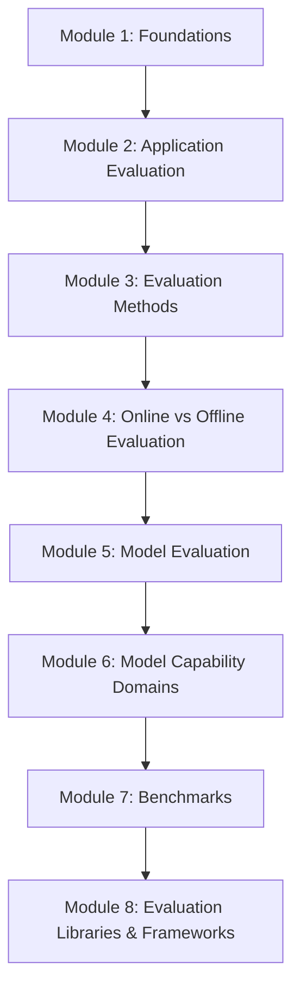
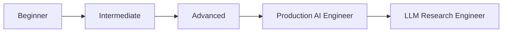

# LLM Evals — The Complete Notes Repository

> A structured, book-style guide to understanding, designing, and building evaluations for Large Language Models — from first principles to production systems.

---

## 📖 What Is This Repository?

**LLM Evals** is a from-scratch, freely available knowledge base on **LLM Evaluation** — the discipline of measuring whether a language model, or an application built on top of one, actually works the way it's supposed to.

This is not a collection of scattered blog posts or a dump of benchmark leaderboards. It is organized, sequential documentation — written the way you'd want a textbook written, if that textbook were also honest about how evaluation is actually done inside AI companies today.

Every module builds on the one before it. By the end, you should be able to:

- Explain *why* LLM evaluation is a fundamentally different problem from traditional software testing
- Design an evaluation strategy for an LLM-powered application, not just a raw model
- Choose the right evaluation method (programmatic, deterministic, human, or LLM-as-a-judge) for a given problem
- Understand the difference between evaluating a *model* and evaluating a *product built on a model*
- Speak fluently about major capability domains (reasoning, coding, math, long context, multimodal, agentic, safety, instruction following)
- Understand what benchmarks like MMLU, GPQA, and TruthfulQA actually measure — and where they fall short
- Know the landscape of evaluation harnesses and frameworks used in the industry
- Walk into an interview and answer eval-related questions with real depth, not memorized definitions

---

## 🤔 Why Does This Repository Exist?

LLM evaluation is one of the fastest-growing — and most poorly documented — disciplines in AI engineering.

Most existing resources fall into one of two traps:

1. **Too academic** — dense papers describing a single benchmark, with no bridge to how evaluation is actually used to ship products.
2. **Too shallow** — a listicle of "top 5 eval tools" with no explanation of the underlying reasoning, tradeoffs, or failure modes.

There was no single place that took a learner from *"I don't know what an eval is"* to *"I can design an evaluation pipeline for a production LLM system"* — in one continuous, well-structured narrative.

This repository exists to be that place.

---

## 👥 Who Should Use This

This repository is written for a wide range of readers, all moving toward the same goal: genuine fluency in LLM evaluation.

| Reader | How this repo helps |
|---|---|
| **Complete beginners** | Every concept starts with intuition before definitions — no assumed prior knowledge |
| **College students** | A structured curriculum that mirrors how the field is actually organized |
| **AI / ML / GenAI Engineers** | Practical grounding for building evals into real systems |
| **Senior Engineers** | A reference for framing eval strategy discussions and design reviews |
| **Interview candidates** | Every topic includes common interview questions and key takeaways |
| **Production engineers** | Focus on failure points, risk categories, and monitoring — not just theory |

---

## 🗺️ Learning Roadmap

The repository is designed to be read **in order**. Each module assumes you've internalized the one before it.



### Conceptual progression



- **Modules 1–2** build the conceptual foundation: what evals are, and how they apply to real applications.
- **Modules 3–4** cover *how* evaluation is actually carried out — methods, and the online/offline lifecycle.
- **Module 5** shifts focus from applications to the underlying model itself.
- **Module 6** goes deep on every major capability domain frontier labs evaluate separately.
- **Module 7** covers benchmarks — the standardized yardsticks of the field, and their limitations.
- **Module 8** surveys the tooling landscape that ties everything together.

---

## 📂 Repository Structure

```text
LLM-Evals/
│
├── README.md                          ← you are here
│
├── docs/
│   ├── module-01-foundations.md
│   ├── module-02-application-evals.md
│   ├── module-03-evaluation-methods.md
│   ├── module-04-online-vs-offline.md
│   ├── module-05-model-evals.md
│   ├── module-06-capability-domains.md
│   ├── module-07-benchmarks.md
│   └── module-08-eval-frameworks.md
│
└── assets/                            ← diagrams and supporting media
```

---

## 📚 Module Overview

| # | Module | What You'll Learn |
|---|---|---|
| 1 | [Foundations](docs/module-01-foundations.md) | Why LLM evals exist, how they differ from software testing, model vs. application evals |
| 2 | [Application Evaluation](docs/module-02-application-evals.md) | Evaluation workflow, failure points, risk categories, reference-based vs. reference-free methods |
| 3 | [Evaluation Methods](docs/module-03-evaluation-methods.md) | Programmatic, deterministic, human, and LLM-as-a-judge evaluation — and when to use each |
| 4 | [Online vs. Offline Evaluation](docs/module-04-online-vs-offline.md) | Offline vs. online evaluation, the evaluation pipeline, self-improving loops, continuous monitoring |
| 5 | [Model Evaluation](docs/module-05-model-evals.md) | Why engineers need model evals, and what model evaluation actually means |
| 6 | [Model Capability Domains](docs/module-06-capability-domains.md) | Deep dives into reasoning, coding, math, long context, multimodal, agentic use, safety, and instruction following |
| 7 | [Benchmarks](docs/module-07-benchmarks.md) | Why benchmarks exist, evaluation harnesses, and major benchmarks: MMLU, MMLU-Pro, TruthfulQA, GPQA, AGIEval |
| 8 | [Evaluation Libraries & Frameworks](docs/module-08-eval-frameworks.md) | The tooling landscape — harnesses, libraries, and frameworks used across the industry |

> **Note:** Modules are generated and added sequentially. If a module file above isn't linked yet, it hasn't been published to this repository.

---

## 🧭 How to Use This Repository

### If you're a beginner

Start at Module 1 and go in order. Don't skip ahead — Module 6 (Capability Domains) will make far more sense once you understand *why* evaluation is split into model vs. application evals (Module 1) and *how* different methods work (Module 3).

Read each module fully before moving on. Every topic is written to build intuition first, so resist the urge to skim for definitions.

### If you're an experienced engineer

You can jump directly to the modules most relevant to your current work — for example, Module 4 (Online vs. Offline Evaluation) if you're building monitoring for a production system, or Module 7 (Benchmarks) if you're evaluating which model to adopt.

That said, Module 2 (Application Evaluation) is worth reading even for experienced readers — it frames failure points and risk categories in a way that's easy to reuse directly in design docs.

### If you're preparing for interviews

Each topic throughout the repository includes a **Common Interview Questions** section. A recommended strategy:

1. Read all 8 modules once, in order, for full context.
2. Do a second pass focused only on the "Interview Questions" and "Key Takeaways" sections.
3. Practice explaining each capability domain in Module 6 out loud — interviewers frequently probe *why* a domain is evaluated separately, not just *what* it is.

---

## 🎯 Expected Learning Outcomes

By completing this repository, you should be able to:

- ✅ Explain the difference between model evaluation and application evaluation, and why conflating them is a common mistake
- ✅ Design a reference-based or reference-free evaluation strategy depending on the problem
- ✅ Choose between programmatic, deterministic, human, and LLM-as-a-judge evaluation methods with clear reasoning
- ✅ Build (or critique) an online/offline evaluation pipeline, including continuous monitoring and self-improving loops
- ✅ Discuss each major model capability domain with real depth — what it measures, why it matters, and how frontier labs test it
- ✅ Critically interpret benchmark scores instead of taking leaderboard numbers at face value
- ✅ Navigate the landscape of evaluation harnesses and frameworks

---

## 💼 Production Engineering Relevance

LLM evaluation isn't just an academic exercise — it's a core part of shipping reliable AI products. This repository is deliberately weighted toward production concerns:

- **Failure points and risk categories** (Module 2) map directly to what breaks in real applications.
- **Online vs. offline evaluation and continuous monitoring** (Module 4) reflect how eval pipelines actually run in CI/CD and post-deployment.
- **Capability domain evaluation** (Module 6) mirrors how frontier labs structure their own internal eval suites before a model ships.

If you're building LLM applications professionally, this repository doubles as a reference you can return to when designing your own eval strategy.

---

## 🔮 Future Modules

This repository is structured to grow. Planned areas for future expansion include:

- Hands-on implementation walkthroughs for building custom evaluation harnesses
- Deeper dives into specific frameworks introduced in Module 8
- Case studies of real-world eval failures and what they revealed
- Dataset construction and curation for custom evals
- Cost and latency tradeoffs in large-scale evaluation runs

---

## 📌 A Note on the Source Material

The content in this repository is derived from a personal, working set of notes on LLM evaluation, reorganized into professional, structured documentation. Every concept from the source notes is preserved — the goal of this repository is to improve *flow, ordering, and clarity*, never to omit content.

---

---

# 👨‍💻 Author

**Ranjan Yadav**

B.Tech Computer Science Engineer | AI/ML & Agentic AI Enthusiast

I created this repository to build a structured, comprehensive learning resource on **LLM Evaluations**, covering concepts from fundamentals to production-grade evaluation systems. The goal is to make complex evaluation topics accessible to everyone—from beginners starting their AI journey to experienced engineers building and deploying LLM applications and AI agents.

## 🔗 Connect with Me

- **GitHub:** https://github.com/Ranjan83711
- **LinkedIn:** https://www.linkedin.com/in/ranjan-yadav-05b62a231/
- **Email:** ranjan2821271@gmail.com

---

## ⭐ Support the Project

If you find this repository useful:

- ⭐ Star the repository
- 🍴 Fork it
- 🛠️ Contribute improvements
- 📢 Share it with others interested in LLMs and AI Engineering

Your support helps make this repository a valuable open-source resource for the AI community.

---

**Happy Learning! 🚀**

---

*Reply with **"Module 1"** to generate the first module: Foundations.*
